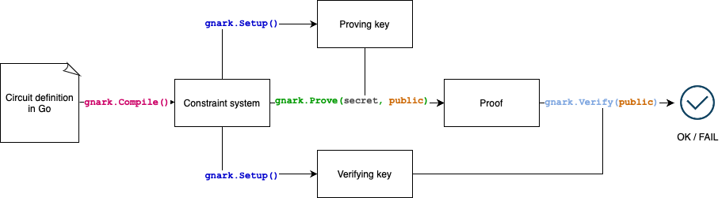

## Introduction

gnark   https://github.com/Consensys/gnark.git

一个go实现的`zk-snark` 库。



目前支持的snark算法： groth16、plonk

支持的椭圆曲线算法：

* BN254 && BLS12_381

  * 针对eth1.x 主网的应用程序，BN254 是唯一受支持的曲线
  * 针对eth2.0 应用则使用 BLS12-381s
  * 对于与平台无关的应用程序，选择需要在性能（BN254）和安全性（BLS12-381）之间进行权衡。

* BLS12-377 && BW6-761

  * 需要单层证明组合的app 不能使用BN254 & BLS12-381(目前来说效率很低)。

  * 这样的程序要一对
    $$
    (E_1,E_2)
    $$
    的椭圆曲线(elliptic curves)

    * 安全可靠
    * 适合配对，用于证明验证
    * 具有高度2-adic 子群阶，以实现高效的证明生成
    * E_2 子群阶数等于E_1 的场特性，高效的证明组合。

  * TIP: 给定E_1 必须具有高度2-adic 场特性，不能使用BLS12-381

* BW6-633 && BLS24-315

  * **Groth16** 中椭圆曲线的运算发生在 **G_1, G_2,G_t** 中，而在**Plonk(**KZG多项式承诺)中，仅发生在**G_1 G_t** 之间。 B**N254、BLS12-381 和 BLS12-377** 针对所有三个组进行了优化。BLS24-315 更好的优化了G_1 仅当仍具有竞争性优化是的G_t 时间。此外，它与 BW6-633 一起采用 2-chain设置，可有效实现 PlonK 一层证明合成。
  * BW6-633 && BLS24-315
    * 配对友好，便于证明生成
    * 针对KZG的znark 进行了优化
    * 具有高度 2-adic 子群阶，以实现高效的证明生成。
    * 为了高效证明合成，BW6-633 的子组阶数等于 BLS24-315 的场特性。

* bls24317


### example

`X^3 + x + 5 == y`

```go
package main

import (
	"github.com/consensys/gnark-crypto/ecc"
	"github.com/consensys/gnark/backend/groth16"
	"github.com/consensys/gnark/frontend"
	"github.com/consensys/gnark/frontend/cs/r1cs"
)

// CubicCircuit defines a simple circuit
// x**3 + x + 5 == y
type CubicCircuit struct {
	// struct tags on a variable is optional
	// default uses variable name and secret visibility.
	X frontend.Variable `gnark:"x"`
	Y frontend.Variable `gnark:",public"`
}

// Define declares the circuit constraints
// x**3 + x + 5 == y
func (circuit *CubicCircuit) Define(api frontend.API) error {
	x3 := api.Mul(circuit.X, circuit.X, circuit.X)
	api.AssertIsEqual(circuit.Y, api.Add(x3, circuit.X, 5))
	return nil
}

func main() {
	// compiles our circuit into a R1CS
	var circuit CubicCircuit
	ccs, _ := frontend.Compile(ecc.BN254.ScalarField(), r1cs.NewBuilder, &circuit)

	// groth16 zkSNARK: Setup
	pk, vk, _ := groth16.Setup(ccs)

	// witness definition
	assignment := CubicCircuit{X: 3, Y: 35}
	witness, _ := frontend.NewWitness(&assignment, ecc.BN254.ScalarField())
	publicWitness, _ := witness.Public()

	// groth16: Prove & Verify
	proof, _ := groth16.Prove(ccs, pk, witness)
	groth16.Verify(proof, vk, publicWitness)
}
```

```shell
groth16 proof generate && verify
10:20:07 INF compiling circuit
10:20:07 INF parsed circuit inputs nbPublic=1 nbSecret=1  //表示我们的电路有两个输入，一个PI，一个则是private input
10:20:07 INF building constraint builder nbConstraints=3  //表示电路有三个约束 x^3 x+5 y
10:20:07 DBG constraint system solver done nbConstraints=3 took=0.019625
10:20:07 DBG prover done acceleration=none backend=groth16 curve=bn254 nbConstraints=3 took=0.860083
// 使用的是groth，曲线则是bn254
10:20:07 DBG verifier done backend=groth16 curve=bn254 took=1.518334
groth16 proof generate && verify success
demo Done
```

