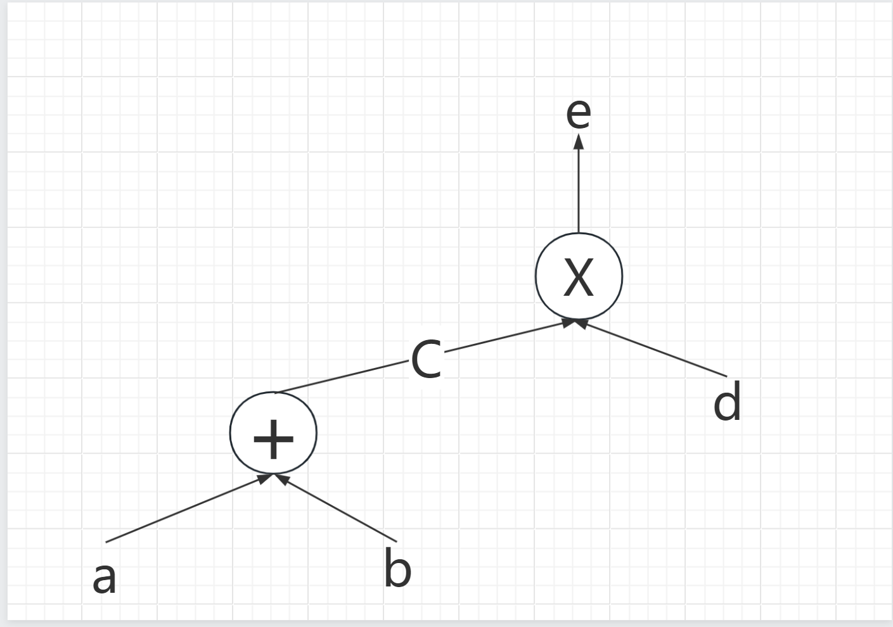

## Halo2

**Halo2** 是一种用于开发零知识证明电路的工具，基于Plonk底层算法和电路构造模式，同时扩展自定义门(custom gate)，和lookup (AKA UltraPLONK)

halo2电路书写形式与其他不同（如bellman），采用**`table`**或**`matrix`**组织定义不同属性值。是根据值的矩形矩阵定义的。使用传统的含义来表示该**`矩阵的行、列和单元格`**。

无需设置setup (使用嵌套均摊)


**Halo2** 提供的工具：

1. **Halo2 电路系统**：
   
   - **Halo2** 的电路系统是由表（matrix/table）定义的，使用行（rows）、列（columns）和单元格（cells）来表示各种不同的意义。
   - **电路的配置**
     - **有限域 F**，其中**cell** (单元格) 值，是F的元素，使用**`Pasta`** 曲线域. 
     - 数据存放在**Table**  中，列有以下几种：
       -  **advice 列（代表 witness）** ，电路中的秘密输入
       - **instance 列（代表 public input   PI）**，`Prover` 和 ` validator` 间共享值。
       - **fixed  列** 作为常量(constant) 使用，plonk paper 中的 q 电路的一部分。  
       - **selector 列**  辅助字段，用于**确定激活门的条件**，在halo2 中作为Fixed列的一种特殊情况，只能取**0,1**
     - **Copy constrain** 作用在两个或者以上不同的Cell 上。
     - **lookup** & **多项式约束**： 约束可以当前行的给定列的cell 值，也可以是该行相对的另一行的给定列。 即 **一个门中的多项式约束**可以**引用多行多列值**。
     - **custom gate**: 表达式多元高次多项式，最高此数可以超过2，每一个custom gate 都有一个对应的selector column 相对应。custom gate 只能引用偏移的**Cell**，偏移值类型是 Rotation。
2. **使用 Mock Prover 进行调试**：
   - **Mock Prover** 是一个用于调试电路的工具，可以在单元测试中，将电路中的每个约束都测试一遍。(halo2_proofs::dev::MockProver)
   - 如果某个约束不满足，则会报错，否则正常返回。
3. **可视化电路**：
   - 使用 **circuit_layout** 工具，可以以图表的形式展示电路的不同部分，例如 advice、fixed 和 instance。
4. **计算电路消耗**：
   - 使用 **cost-model** 工具，可以计算电路生成的证明大小以及验证所需的时间。
5. **电路开发示例**：
   - 假设我们要开发一个电路，其中 a 和 b 是私有输入，c 是公共输入，要证明 
     $$
     a^2 * b^2 = c
     $$
     
   - 需要定义 instructions 来处理乘法操作，以及相应的 chip 实现。
6. **构造电路**：
   
   - 使用 **circuit trait**，定义自己的电路结构并接入 witness 输入。
   - 需要实现 **configure、synthesize** 等函数。




如图构造了一个简单的电路描述，包含两个约束

- a + b =c 
- c * d = e

构造的表如下

| advice | advice | advice | selector(add) | selector(mul) |
| ------ | ------ | ------ | ------------- | ------------- |
| a      | b      | c      | 1             |               |
| c      | d      | e      | 0             | 1             |

表中两行分别表示了上述两个约束方程，第一行满足 a + b - c = 0 ， 第二行满足 c * d - e = 0 . 其中还隐含了一个复制约束，column [2] [0] = column [0] [1]


#### keyword

1. Chip：电路由多个Chip逻辑组成，每个Chip的创建是从`config` 开始的。 小的逻辑单元。
2. Config：申请Chip需要的Column以及配置Fixed列的逻辑含义。这些配置可能是Custom Gate，可能是lookup。
3. Instructions：每一个Chip都有指令（Instruction）。通过指令的调用，将Chip的部分或者全部功能加入电路中。
4. Layouter：将Chip添加到一个电路上需要布局。Layouter就是用来实现布局。
   - Layouter本身存在层级关系，所以Layouter的接口定义了 `get_root` `push_namespace` `pop_namespace` `namespace`等方法，核心逻辑在其他三个函数：
     - `assign_region`: 获取一个region，在其之上进行各种`assignment` (电路赋值)，定义在`RegionLayouter`接口中。
     - `assign_table` : 获取一个table，并设置table，接口定义在`TableLayouter`接口中。
     - `constrain_instance`: 限制一个`Cell` 和`instance`列中的某个`Cell`一致。
5. **Assginment** ：Assignment是一个电路“赋值”的接口。电路的实际赋值

> 关于region的一些信息：
>
> 在 halo2 中我们不会直接约束一整个电路的行和列，而是将整个电路划分为由相邻的行和列组成的 region，在 region 中可以采用相对偏移(relative offsets)的方式**访问 Cell**。 在一个 region 中，我们只关心 cells 之间的**相对关系**。
>
> 如果两个约束没有关系，或者也不关心两个 “cell” 之间如何相互作用的话，那么就应该将它们分别定义在 2 个不同的 regions 中，如此就可以将控制权交给halo2默认的**layouter**，让 layouter 去优化整体电路 region 分布，比如合并不同的region到一行来减小电路的规模。
>
> layouter 作用在 assignment （电路赋值）期间，即当 Witness 去填充整个 Circuit table 时使用。实际中，**layouter一般不会一下子填满整个 table， 而是每次都会创建一个 region，并在其包含的单元格中填入相应的witness值。**
>
> 为了保证每个 gate 能当访问到其所需的所有单元格，一般而言对 gate 所在的 region 进行电路布局时，region 需遵循如下规则： **region 不需要与 custom gate 具有相同的形状，但 region 必须覆盖所有相关的 custom gate**


### Hlao2 中的电路布局 circuit layout

1. TracingFloorPlanner 可用于检测电路，并准确确定在特定注册机或证明运行期间发生的情况。这对于识别意外的非确定性或电路变化非常有用。
2. V1
   1. 没有colunm 优化，电路配置完全由开发者自定。
   2. 双通道布局器用于在分配之前region。
   3. Region 为矩形，以他们分配的cell 为界。
   4. region 采用贪婪的先拟合策略进行布局，按region的 `advice area`（建议列数 * 行数）对区域进行排序。
3. SimpleFloorPlanner，目前常用的电路布局器，旨在反映电路的业务逻辑，它使用单通道
   布局器，它为该区域中使用的每一列找到第一个空行并获取其所需的最多的单元格。它尝试尽可能多地合并相关的 regions 以使用**更少的行**。  

一般而言，我们需要在电路布局做如下权衡：

- 减少电路使用的空间 (space) ，因为行数越多，fft 操作越多，Prove 过程就越慢
- 增加电路的列数， *Prover* 需要 commit 每个列，更多的列数，意味着更多的 `commitments`，也就意味着更大的 `proof size`


### Lookup

在Halo2中，lookup是一种重要的技术，它允许在**任意集合中进行查找**，而且比Plookup更简单。

Halo2的lookup技术可以被看作是一种**在变量之间强制执行关系的方法**，其中关系是通过`table`来表示的。这种查找技术允许**在固定或可变的表格中查找值**。这意味着可以在固定的表格中进行范围证明，或者在可变的表格中（包括建议列）验证一个电路的输入是否属于另一个电路的输出。


Lookup table 的用途： 

1. 优化算术运算：预先计算复杂运算的值（如乘法逆或模数约简），以加快运行时计算速度。 
2. 高效的多项式计算：存储多项式在不同点的计算结果，减少了在证明生成过程中动态计算这些计算的需要。 
3. 约束满足：通过存储满足这些约束的有效值对，帮助确保满足特定约束。


实施细节 ： 

1. 表定义：指定查找表的结构，包括输入和输出。 
2. 预计算：计算要存储在表中的值。 此操作只需完成一次即可重复使用多次。
3. 查找参数：通过查找参数将查找表合并到 ZKP 系统中，该参数断言证明中的某些值对应于查找表中的条目。


使用查找表的好处 

1. 性能：由于计算量减少，证明生成和验证的速度显着加快。 
2. 简单性：简化复杂算术运算的实现。 
3. 可扩展性：通过卸载密集计算，可以处理更大、更复杂的证明。

缺点：

1. 内存开销：查找表可能会消耗大量内存，尤其是对于大型表。 
2. 预计算时间：预计算表的初始设置时间可能很长，尽管这会分摊到许多用途中。


lookup 必须使用 `complex_selector`，因为 Halo2 可以根据这个标记知道这种 Selecotr 列不需要优化，而普通的 Selector 则可能会被 Layouter 进行合并等优化操作。


[example code]([halo2_demo/src/examples/range_lookup.rs at master · Chengcheng-S/halo2_demo (github.com)](https://github.com/Chengcheng-S/halo2_demo/blob/master/src/examples/range_lookup.rs#L21))

```rust
pub fn configure(meta: &mut ConstraintSystem<F>, value: Column<Advice>) -> Self {
        let q_lookup = meta.complex_selector();

        let table = table::LookupTable::<F, RANGE>::configure(meta);

        meta.lookup(|meta| {
            let q_lookup = meta.query_selector(q_lookup);
            let v = meta.query_advice(value, Rotation::cur());
            vec![(q_lookup * v, table.table)]
        });

        RangeConfig {
            value,
            table,
            q_lookup,
        }
    }
```

witness 的填充则使用的是assign_table 

[example code]([halo2_demo/src/examples/table.rs at master · Chengcheng-S/halo2_demo (github.com)](https://github.com/Chengcheng-S/halo2_demo/blob/master/src/examples/table.rs#L21))

注意到使用 Zcash 版本 Halo2 进行 `lookup` 约束时，由于没法对 TableColumn 进行 `query_advice`这导致除了 `lookup` 约束外，无法灵活地对 `TableColumn` 中的 cell 进行 gate 约束，即`TableColumn`必须在电路初始化阶段写死，无法再更改了，即只能进行静态查找。


**ConstrainSystem**: 电路的静态约束（电路本身的约束关系） ，在其他zk项目中，则是包含电路的所有信息。

### **Permutation**

（Permutation Argument） 置换证明，Plonk 协议中的核心部分，

Copy/Equal constraint  

集合从自身到自身的一个映射。 按照某种规则把集合中的元素组合成自生元素的重新排序。

>在 PLONK 中，Permutation 是一种证明系统，用于处理零知识证明中的特定问题。PLONK 的 Permutation 主要用于处理电路中的本地操作，即在当前行或定义的相对行中的cell。为了实现这一点，PLONK 需要从任意单元格中复制一个值到门（gate）所在的当前行。这通常通过等式参数（equality argument）的方式来实现。
>
>具体来说，PLONK 的 Permutation 通过以下方式工作：
>
>定义一个循环映射关系（cycle），例如 cycle (a,b,c) 表示元素之间的循环映射关系，即：map [a] = b, map [b] = c, map [c] = a2。
>对于一个多项式 f(x)，其部分点的取值可以通过这个循环映射关系来确定。
>在 Halo2 中，Permutation 的工作原理稍有不同。Halo2 的 Permutation 主要用于处理电路中的本地操作，即在当前行或事先定义好的相关行进行操作。这通常需要将某个任意单元格的值拷贝到当前行，以便在门中使用3。这种工作就由一条相等约束来描述，该约束就强制要求源和目的单元格中包含相同的值。我们通过构造一个代表这些约束的置换来实现这些相等约束，进而在最终的证明中包含一个置换证明来确保约束成立。


理解Halo2，可以从两部分着手：

- 电路构建。 
- 证明系统。

从开发者的角度看，**电路构建是接口**。如何通过Halo2创建电路，这些电路在Halo2的内部如何表示是理解电路构建的关键。**Halo2中的Chip电路由一个个Region组成**，在Halo2的框架中，**Region通过Layouter进行分配**。电路的**所有的信息都存储**在**`Assignment`**的接口中。

Halo2的电路构建分为两部分：

- Configure （电路配置）
  - 申请advice 、instance、 fixed、 columns
  - 定义custom gate
  - 定义lookup （input expression 、 table expression） 

- Synthesize（电路综合）
  - 分配region
  - 给region 中的变量赋值
    - `assign_advice`
    - `assign_advice_from_constant`
    - `assign_advice_from_instance`
    - `assign_fixed`  
    - path: halo2_proofs/src/circuits.rs


简单的说，**Configure就是进行电路本身的配置**。**Synthesize进行某个电路实例的综合。**


## 可信设置？

### 递归证明

Halo 2 利用递归证明技术，使得一个证明可以嵌套在另一个证明中，从而能够在不需要额外可信设置的情况下实现复合证明。递归证明技术通过以下方式实现：

* **循环递归**（halo2 loop recursion）：利用循环递归技术，证明者可以证明一系列子证明的正确性，而这些子证明本身又可以包含其他证明。这种方式使得整个证明过程可以高效地进行，并且无需可信的初始设置。
* **证明聚合**：Halo 2 允许将多个证明聚合成一个单一的证明，从而减少验证的复杂度和计算成本。这种聚合方法利用了递归证明的特性，使得证明的生成和验证更加高效。

### 多项式承诺方案

使用PLONK，PLONK 提供了一种高效的多项式承诺方法，其主要特性包括：

* **通用性**：PLONK 是一种通用的多项式承诺方案，可以应用于各种不同类型的电路和计算问题，而不需要特定的可信设置。
* **透明性**：PLONK 的设计确保了系统参数可以在无需可信第三方的情况下生成。其多项式承诺和验证过程依赖于公开的随机数和公开的参数生成方法，从而避免了可信设置的需求。

### 公开参数生成

Halo 2 采用了一种透明的公开参数生成方法，确保了所有系统参数都可以通过公开的方式生成并验证。这种方法依赖于：

- **透明随机数生成（Transparent Randomness Generation）**：使用公开的随机数生成方法，如公共随机信标（public random beacons）或加密哈希函数，确保所有参与者都可以验证参数的正确性和随机性。
- **无信任假设（Trustless Assumptions）**：所有系统参数和随机数的生成过程都是公开和可验证的，从而消除了对任何可信第三方的依赖。

### 优化电路表达

* **高效的 R1CS 表达（Rank-1 Constraint System）**：通过高效的 R1CS 表达，将复杂的计算问题转化为简单的线性约束问题，从而提高了证明生成和验证的效率。
* **门限门（Threshold Gates）**：引入门限门的概念，允许在电路中使用更复杂的逻辑门，从而减少了电路的深度和复杂度，进一步提高了证明的效率。


