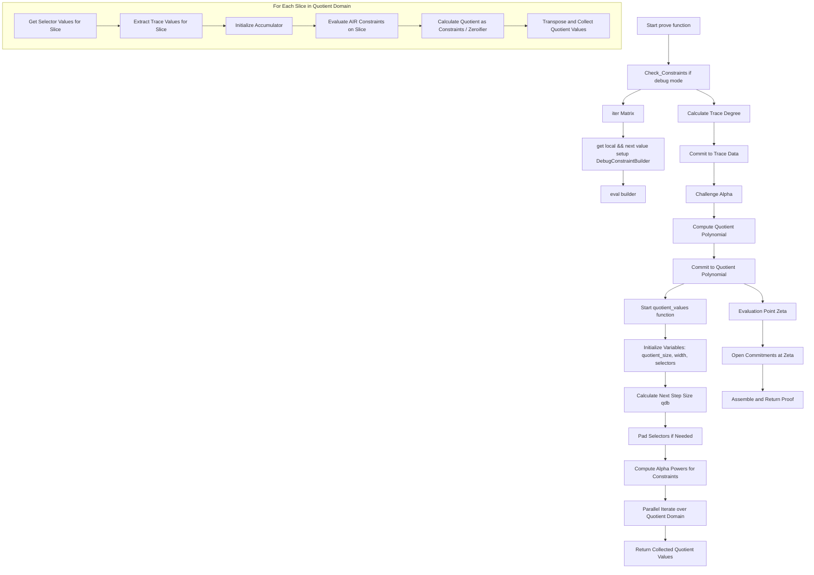
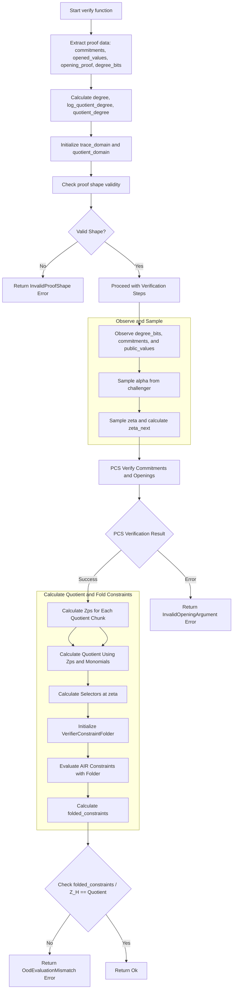
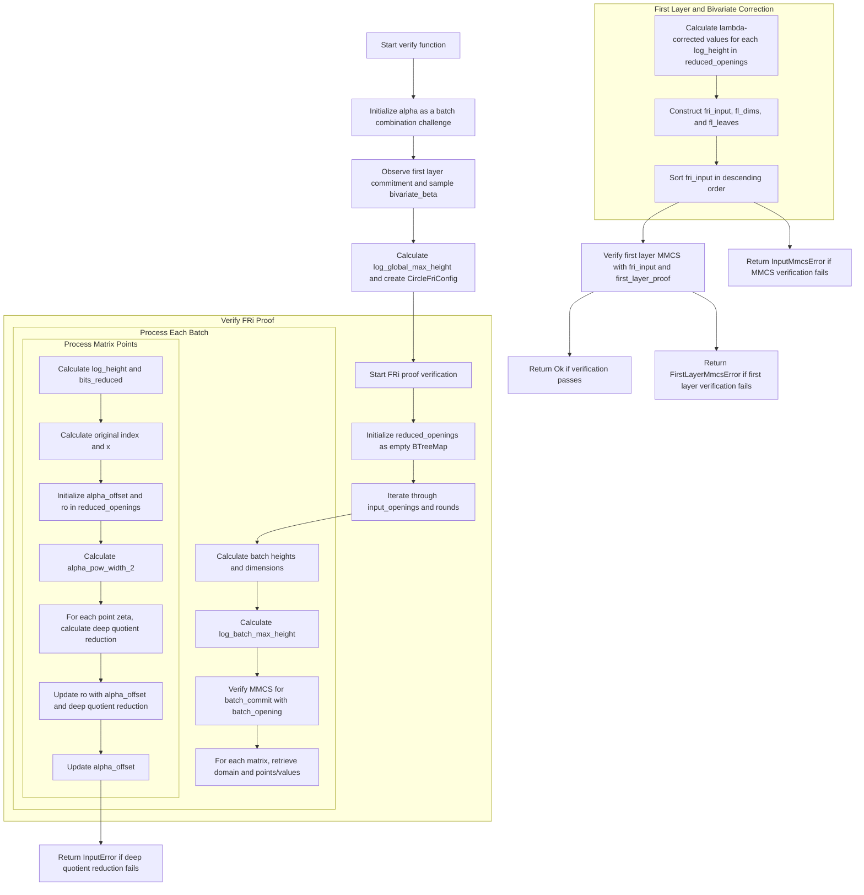

## plonky3

Git: git@github.com:Plonky3/Plonky3.git

Plonky3 是一个用于设计自定义 ZK 证明实现的工具包，可用于为应用程序优化的 zkVM 和 zkEVM 提供支持（如sp1,这部分可以去了解sp1源码中 stark machine 以及各个chip的具体实现）。同时也支持多个有限域和哈希函数。

### Workflow

1. 使用AIR 定义业务逻辑
2. 生成基于AIR的计算轨迹
3. 利用高效的有限域实现进行算术运算
4. 使用向量承诺方案（如 MMCS）来创建对轨迹的简洁承诺。
5. 构造轨迹多项式，并使用多项式承诺方案（如 Circle PCS）提交这些多项式
6. 使用 FFT 和相关算法执行快速多项式运算。
7. 实现 FRI（快速 Reed-Solomon IOP）协议来证明有关承诺多项式的属性。
8. 对于非交互式证明，采用 Fiat-Shamir 方法和挑战者机制。
9. 使用STARK prover 将所有组件结合起来生成证明。
10. 验证者使用相同的组件来有效地检查证明的有效性。

>  TIP:
>
>  没错plonky3 具体的工作流程和stark 证明系统的工作流程很类似，都是使用AIR以及轨迹多项式，同样也使用了FRI protocol。
>
> 但是二者之间也是有些差异的：
>
> ​	**算法设计**：Plonky3 使用了一种混合型架构，将基于加法的 Plonkish 框架和 AIR 结合，从而具有灵活的约束表达力。这使得 Plonky3 能够在保证证明性能的同时更好地表达复杂电路。
>
> ​	**多项式承诺方案**：Plonky3 还可能采用不同的多项式承诺方案，以提高效率，或结合其他优化策略（如使用更高效的散列函数），这与一些标准 STARK 实现可能有所不同。
>
> ​	**领域适配性**：STARK 通常应用于需要高并发计算的环境，而 Plonky3 的混合特性使其更适合处理结构化的、基于分层电路的任务。

对于开发者而言，只需要着重关注前两步即可，之后的步骤交给stark prover 处理就行了。

### example
一个基于plonky3的fibonacci示例。

#### 定义AIR的逻辑

AIR Constraint 是关于处理执行trace的，可以将其抽象为 2D矩阵。**每行代表计算的当前迭代，每行的宽度代表与整个计算相关的元素**。基本上，在 zkVM 上下文中，**行的宽度是这个 zkVM 系统中的所有寄存器，每一行迭代是所有寄存器从一个 PC 计数到下一个的转换。**

> Tip :
>
> * 定义有效的状态转换，行与行之间转换的约束
> * 如果需要，定义同一行中字段之间的关系，有时我们的约束也只针对单个列，比如如果某列应该是 0 或 1，我们执行 x (x - 1) = 0（或 assert_bool() 简写）
> * 如果程序必须从特定的初始状态开始运行，则定义初始状态的约束
> * 如果程序结果需要在该程序执行结束时公开，则定义对结束状态的约束。、

在当前的fibo的例子中，每行是当前要添加的 2 个数字，因此宽度为 2。每行都会有一个关系：

* 当前行的第二个field是下一行的第一个field
* 当前行的两个field之和等于下一行的第二个field
* 程序的初始状态 确保是从0｜1 开始，验证输出是否符合预期即可。

```rust
pub struct MyAir{
    pub num_steps: usize,
    pub final_value:u32,
}

impl<F:Field> BaseAir<F> for MyAir{
    fn width(&self) -> usize{
        2 // NUM_FIBONACCI_COLS
    }    
}

// our constraints
impl<AB: AirBuilder> Air<AB> for MyAir{
    fn eval(&self, builder: &mut AB) {
        let main = builder.main();
        let local = main.row_slice(0);
        let next = main.row_slice(1);

      	// init local[0] = 0. local[1] = 1
        builder.when_first_row().assert_eq(local[0], AB::Expr::ZERO);
        builder.when_first_row().assert_eq(local[1], AB::Expr::ONE);
		
        // Enforce state transition constraints
       // next[0] = local[1]   next[1] = local[0] + local[1]
        builder.when_transition().assert_eq(next[0], local[1]);
        builder.when_transition().assert_eq(next[1], local[0] + local[1]);

        // Constrain the final value
        let final_value = AB::Expr::from_canonical_u32(self.final_value);
        builder.when_last_row().assert_eq(local[1], final_value);
    }
}
```

#### 定义基于air生成计算轨迹

是创建一个函数来**跟踪每次迭代的所有相关状态**，并将它们全部推送到一个向量中，然后最后将这个一维向量转换为与 AIR 脚本宽度匹配的维度中的矩阵。

```rust
pub fn generate_air_trace<F: Field>(num_steps: usize) -> RowMajorMatrix<F>{
    let mut values = Vec::with_capacity(num_steps * 2);
		
   //initial state 0，1
    let mut a = F::ZERO;
    let mut b = F::ONE;

   // fill in the states in each iteration in the `values` vector
    for _ in 0..num_steps {
        values.push(a);
        values.push(b);
        let c = a + b;
        a = b;
        b = c;
    }
   //Convert it into 2D matrix
    RowMajorMatrix::new(values, 2)
}
```

> trace table
>
> | col 0 | col 1 |
> | ----- | ----- |
> | 0     | 1     |
> | 1     | 1     |
> | 1     | 2     |
> | 2     | 3     |
> | 3     | 5     |
> | 5     | 8     |
> | 8     | 13    |
> | 13    | 21    |

#### 定义File 以及HashFunc

```rust
 type Val = BabyBear;
 type Perm = Poseidon2<Val, Poseidon2ExternalMatrixGeneral, DiffusionMatrixBabyBear, 16, 7>;
 type MyHash = PaddingFreeSponge<Perm, 16, 8, 8>;
```

> Fields:
>
> - Goldilocks
> - BabyBear
> - KoalaBear
> - Mersenne31
> - BN254
>
> Hashes:
>
> - Poseidon
> - Poseidon2
> - Rescue
> - Monolith
> - Keccak
> - Blake3
> - SHA-2

#### zk系统设置

```rust
type MyCompress = TruncatedPermutation<Perm, 2, 8, 16>;
 type ValMmcs =
            MerkleTreeMmcs<<Val as Field>::Packing, <Val as Field>::Packing, MyHash, MyCompress, 8>;
 type Challenge = BinomialExtensionField<Val, 4>;
 type ChallengeMmcs = ExtensionMmcs<Val, Challenge, ValMmcs>;
 type Challenger = DuplexChallenger<Val, Perm, 16, 8>;
 type Dft = Radix2DitParallel<Val>;
 type Pcs = TwoAdicFriPcs<Val, Dft, ValMmcs, ChallengeMmcs>;
 type MyConfig = StarkConfig<Pcs, Challenge, Challenger>;

let hash = MyHash::new(perm.clone());
let compress = MyCompress::new(perm.clone());
let val_mmcs = ValMmcs::new(hash, compress);
let challenge_mmcs = ChallengeMmcs::new(val_mmcs.clone());
let dft = Dft::default();
let num_steps = 16; // Choose the number of Fibonacci steps
let final_value = 610; // Choose the final Fibonacci value
let air = MyAir { num_steps, final_value };
let trace = generate_air_trace::<Val>(num_steps);
let fri_config = FriConfig {
            log_blowup: 2,
            num_queries: 28,
            proof_of_work_bits: 8,
            mmcs: challenge_mmcs,
        };
let pcs = Pcs::new(dft, val_mmcs, fri_config);
let config = MyConfig::new(pcs);
let mut challenger = Challenger::new(perm.clone());    
```

* 定义一个 compress funciton，用于MMCS(Multi-Merkle Commitment Tree)构建过程
* 使用Filed、Hashfunc和compress func  MMCS实例，称为ValMmcs。
* 将 ValMmcs 实例扩展到与 Challenge 相同的扩展字段中，称为 ChallangeMmcs
* 定义一个用于生成证明的challenger（在 PIOP 过程中是必需的），它将在 STARK 配置中使用。基本上是为 PIOP 过程创建随机挑战输入。
* 定义fri_config(Fast Reed-Solomon IOP)，然后用于创建Pcs（多项式承诺方案）。
* 使用Pcs、Challenge、Challenger ，构建STARK 配置。

#### Prove & verify

```rust
let proof = prove(&config, &air, &mut challenger, trace, &vec![]);
let mut challenger = Challenger::new(perm);
verify(&config, &air, &mut challenger, &proof, &vec![]).expect("verification failed");
```


### prove

```rust
pub fn prove<
    SC,
    #[cfg(debug_assertions)] A: for<'a> Air<crate::check_constraints::DebugConstraintBuilder<'a, Val<SC>>>,
    #[cfg(not(debug_assertions))] A,
>(
    config: &SC,
    air: &A,
    challenger: &mut SC::Challenger,
    trace: RowMajorMatrix<Val<SC>>,
    public_values: &Vec<Val<SC>>,
) -> Proof<SC>
where
    SC: StarkGenericConfig,
    A: Air<SymbolicAirBuilder<Val<SC>>> + for<'a> Air<ProverConstraintFolder<'a, SC>>,
{
  
  // debug 模式下对race 和 public_values 进行验证，确保轨迹满足 AIR 定义的代数约束。 
  #[cfg(debug_assertions)]
  crate::check_constraints::check_constraints(air, &trace, public_values);
  
  // 根据 trace 的高度来确定多项式的度数（degree），以及相应的对数值 log_degree。接下来，获取符号约束并计算出约束的度数和度数的对数（log_quotient_degree）。
  let degree = trace.height();
	let log_degree = log2_strict_usize(degree);
	... 
	let log_quotient_degree = log2_ceil_usize(constraint_degree - 1);
	let quotient_degree = 1 << log_quotient_degree;
  
  // 使用 PCS（Polynomial Commitment Scheme）对 trace 数据进行承诺，并在 challenger 中记录观察的轨迹承诺和 public_values。
  let pcs = config.pcs();
	let trace_domain = pcs.natural_domain_for_degree(degree);
	let (trace_commit, trace_data) =
    info_span!("commit to trace data").in_scope(|| pcs.commit(vec![(trace_domain, trace)]));
  
  // 随机挑战点
  let alpha: SC::Challenge = challenger.sample_ext_element();
  
  // 计算商多项式并提交
  let quotient_values = quotient_values(
    air,
    public_values,
    trace_domain,
    quotient_domain,
    trace_on_quotient_domain,
    alpha,
    constraint_count,
);
  
  let (quotient_commit, quotient_data) = info_span!("commit to quotient poly chunks")
      .in_scope(|| pcs.commit(izip!(qc_domains, quotient_chunks).collect_vec()));
challenger.observe(quotient_commit.clone());
  
  // 打开承诺以及生成证明
  
  let (opened_values, opening_proof) = info_span!("open").in_scope(|| {
      pcs.open(
          vec![
              (&trace_data, vec![vec![zeta, zeta_next]]),
              (&quotient_data, (0..quotient_degree).map(|_| vec![zeta]).collect_vec()),
          ],
          challenger,
      )
  });
  let trace_local = opened_values[0][0][0].clone();
  let trace_next = opened_values[0][0][1].clone();
  let quotient_chunks = opened_values[1].iter().map(|v| v[0].clone()).collect_vec();
	
  Proof {
        commitments,
        opened_values,
        opening_proof,
        degree_bits: log_degree,
    }
}
```

prove workflow





### Verify 

批量组合挑战、递归验证打开值和第一层的多项式承诺，逐层检查和折叠FRI证明的正确性，以确保证明符合AIR约束。

```rust
pub fn verify<SC, A>(
    config: &SC,
    air: &A,
    challenger: &mut SC::Challenger,
    proof: &Proof<SC>,
    public_values: &Vec<Val<SC>>,
) -> Result<(), VerificationError<PcsError<SC>>>
where
    SC: StarkGenericConfig,
    A: Air<SymbolicAirBuilder<Val<SC>>> + for<'a> Air<VerifierConstraintFolder<'a, SC>>,
{
  
  //domin 
  let trace_domain = pcs.natural_domain_for_degree(degree);
  let quotient_domain =
        trace_domain.create_disjoint_domain(1 << (degree_bits + log_quotient_degree));
  let quotient_chunks_domains = quotient_domain.split_domains(quotient_degree);

  //Observe the instance.
  challenger.observe(Val::<SC>::from_canonical_usize(proof.degree_bits));
  challenger.observe(commitments.trace.clone());
  challenger.observe_slice(public_values);
  let alpha: SC::Challenge = challenger.sample_ext_element();
  challenger.observe(commitments.quotient_chunks.clone());
  // challenge
  let zeta: SC::Challenge = challenger.sample();
  let zeta_next = trace_domain.next_point(zeta).unwrap();
	
  // psc verify
  pcs.verify(...)
  // quotient ploy
   let quotient = opened_values
        .quotient_chunks
        .iter()
        .enumerate()
        .map(|(ch_i, ch)| {
            ch.iter()
                .enumerate()
                .map(|(e_i, &c)| zps[ch_i] * SC::Challenge::monomial(e_i) * c)
                .sum::<SC::Challenge>()
        })
        .sum::<SC::Challenge>();
   
  // eval 
  air.eval(&mut folder);
}
```




PCS verify && opening 

验证FRI（Fast Reed-Solomon Interactive Oracle Proof）证明：

1. **生成挑战值**：从证明的提交阶段提交的承诺中生成挑战值 `betas`。
2. **检查查询数量**：确保查询证明的数量与配置中的查询数量一致。
3. **验证工作量证明**：检查工作量证明是否有效。
4. **验证查询证明**：对每个查询证明进行验证，包括打开输入、计算折叠评估值，并与最终多项式进行比较。



