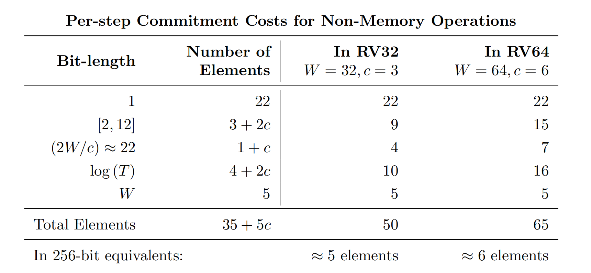

以下部分来自Jolt论文。

对于64位数据类型（带有多重扩展）上的RISC-V指令，Jolt的P向RISC-V CPU的每步提交不到60个字段元素。其中只有6个场元素大于2 没有一个大于264。对于基于msm的多项式承诺，Jolt证明器的成本大致相当于每个CPU步骤提交6个任意（256位）字段元素。

与其他的zkvm一样，Jolt采用通用电路的设计，一个电路适用于所有的RISC-V程序。

lasso 

引入了一系列名为Lasso的查找参数。此中的查找参数是第一个**不需要任何一方以加密方式提交到该选项卡的参数** le向量T∈FN，只要T满足下面定义的两个结构性质之一

1. MLE structured tables  如果对于任何输入r∈F log (N)，e T (r)可以用O（log(N)）字段操作来计算，则向量T∈FN是MLE结构的。
2. Decomposable tables  （可分解的表）。让T∈FN，如果存在一个常数k和α≤kc表T1，T是c可分解的，Tα每个大小为N1/c，每个MLE结构，以及一个多线性α -变量多项式g，使以下条件成立。与第2.1节一样，让我们将T视为函数映射{0,1} log N到F的函数，并将每个Ti视为函数映射{0,1} log (N)/c →∈.然后对于任何r∈{0,1}日志N，写r =（r1，…，rc）∈{0,1}日志(N)/c

MLE结构化表和可分解表之间的关系。对于任何可分解表T∈FN，T有一些低度的扩展Tˆ(即每个变量中最多k的扩展 可以)，可以在O（log N）时间内进行计算。具体来说，扩展多项式是
$$
Tˆ(r) = g( eT1(r1), . . . , Teα(rc)).
$$
笼统来讲RISC-V 由一个CPU 和可读写的内存组成，统称为 `machine`。

**machine state** 包含 PC、R、 M

* R 表示 32个整数寄存器，每个占据W bit （w 为 32 ｜64）
* M 是一个线性的读写字节可寻址数组，由固定的数量的总位置组成，每个位置存储1 bit
* PC 也是W bit，存储要执行的执行的内存地址。

汇编程序由一系列的指令组成，每一个都在机器状态下运行。在一个步骤中要执行的指令是存储在PC所指向的地址上的指令。除非有说明规定，否则PC是先进到 执行该指令后的下一个内存位置。RISC-V ISA指定所有指令都是32位长（即4字节），因此将PC推进到下一个内存位置需要incr 电解PC4。

任何RICS-V的指令都可以转换为以下格式 [opcode, rs1, rs2, rd, imm]。 也就是说 **每条指令指定一个唯一标识其函数的操作代码**，最多有**两个源寄存器rs1、rs2**、一个**目标寄存器rd**和**一个常量值imm**(代表“imm” “**编辑**”)，在程序代码本身中提供。

> **CPU Step Transition:**
>
> 1. Read the instruction at location PC in Program Code.
>
> Parse instruction as [opcode, rs1, rs2, rd, imm].
>
> 2. Read the *W*-bit values stored in registers rs1*,* rs2.
> 3. If required, write to or read from memory.
>
> *The value written and memory location accessed are derived from the values stored in* *rs1**,* *rs2**,* *imm**.*
>
> 4. Perform the instruction’s function on the values read from registers and imm to get result.
>
> *Examples of functions are arithmetic, logical and comparison operations.*
>
> 5. Store result to register rd.
>
> *Only a few instructions, like STOREs, do not involve* *rd**.*
>
> 6. Update PC.
>
> *PC* *is usually incremented by 4, but instructions like jumps and branches update* *PC* *in other ways.*

约束系统的主要职责是在查找之前的每一步中准备适当的操作数x，y。这是有效的，因为操作数只来自于rs中的集合{ value in rs1，value in rs2，imm，PC}

ADD和ADDI由相同的查找表表示，因为它们只在第二个操作数是来自寄存器rs2还是imm方面有所不同.

所有查找查询和条目的跟踪将被发送到Lasso。，Lasso要求查询被分割成chunk，这些块被输入到不同的子表中。提供者专业人士 将这些块作为建议，对于一些小的常数c是c，因此大约有W/c或2W/c位长，这取决于z的结构。约束系统必须验证这些 chunk正确地构成z，但**不需要执行任何范围检查**，因为**Lasso算法本身后来隐式地在块上执行这些检查**。

machine state transtiation 包含读取和写入三个概念上独立的内存部分：

1. program code
2. registers
3. RAM random access memory

正如zkVM设计中的标准一样，Jolt将内存检查过程概念化为一个黑框，它保证了CPU执行所需的所有内存读写的正确性，因此 证明继续假设这些操作是正确的。

### The cost of lookup

证明程序在进行查找查询时所产生的成本。像往常一样，这是根据要提交的**元素的位长**来分析的。大多数查找查询都需要将`x∥y∈{0,1} 2W` 解析成c块，然后发送到Lasso中的∥子表。这涉及到对3c元素的震动证明者的承诺:

1. c 是chunk本身，他们是 2w/c bit
2. c是所涉及的子表中的条目，长度可达W/c bit
3. c元素是子表的“访问计数”，可以上升到T，当前的step 

使用参数设置（W = 32，c = 3）和（W = 64，c = 6），所涉及的前两个位长为2W/c≈22和W/c≈11。许多指令（如SLL）都涉及到较小的clos查找查询 Er到W位，可以被分割成更少的块，导致在每个组中承诺的元素数量的比例减少。

