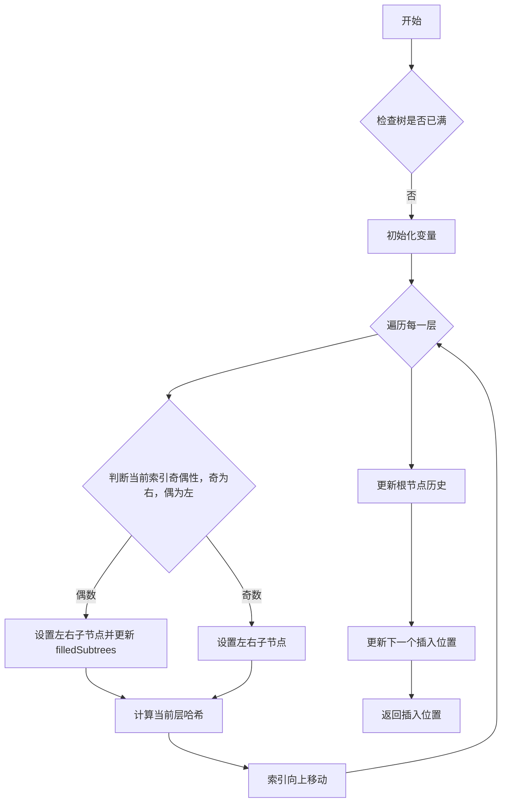
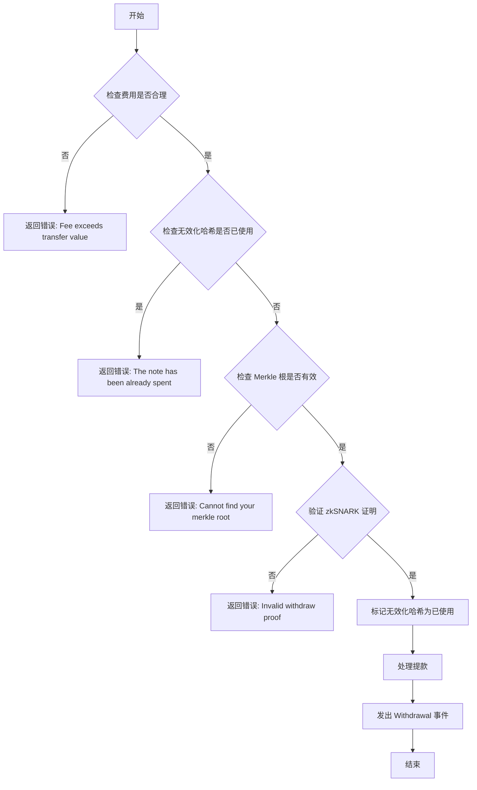

## source code

Tornado cash :  git@github.com:tornadocash/tornado-core.git

### deposit

```solidity
/**
  @dev Deposit funds into the contract. The caller must send (for ETH) or approve (for ERC20) value equal to or `denomination` of this instance.
  @param _commitment the note commitment, which is   PedersenHash(nullifier + secret)
**/
function deposit(bytes32 _commitment) external payable nonReentrant {
/**
这一行代码检查该 commitment 是否已经被提交过。这是为了防止同一笔存款被多次提交。commitments 是一个存储所有已提交 commitment 的映射。
**/
    require(!commitments[_commitment], "The commitment has been submitted");

/**
将commitment 存入merkle tree 
**/
    uint32 insertedIndex = _insert(_commitment);
    commitments[_commitment] = true;
    _processDeposit();

    emit Deposit(_commitment, insertedIndex, block.timestamp);
}
```

在deposit 方法中关键点是 `_commitment` ，commitment 的作用是将存款与特定的提款信息（nullifier 和 secret）绑定起来，同时隐藏这些信息，直到用户想要提款。

计算方式则 使用pedersen hash 

```shell
_commitment = PedersenHash(nullifier + secret)
```

* `nullifier`： 随机生成的值，目的是**防止双花**，一旦存款被提取，其对应的 nullifier 就会被记录在链上，防止同一笔存款被再次提取。
* `secret`：随机生成的值，只有存款者知道。它与 nullifier 一起用于生成 commitment，并在提款时用于生成零知识证明。

Commitment 在 Tornado Cash 中的作用：

- **隐藏存款信息：** 由于 commitment 是 nullifier 和 secret 的哈希值，因此在不知道 nullifier 和 secret 的情况下，无法从 commitment 中推断出任何关于存款的信息，包括存款金额、存款者身份等。
- **实现隐私提款：** 用户在提款时需要提供与 commitment 对应的 nullifier 和 secret，并生成一个零知识证明，证明自己拥有这些信息，而无需实际透露这些信息。合约会验证零知识证明和 nullifier 是否未被使用过，如果验证通过，则允许用户提取资金。
- **防止双重支付：** 通过记录已使用的 nullifier，可以防止同一笔存款被多次提取。

### Relayer机制详解

Tornado Cash的一个关键创新是引入了Relayer机制，解决了隐私交易的"最后一公里"问题。

#### 问题背景

当用户想要从Tornado Cash提取资金时，面临一个困境：新地址没有ETH支付gas费，而使用原地址支付gas会泄露隐私关联。

#### Relayer工作原理

Relayer是第三方服务，代表用户提交提款交易并支付gas费，从提取的金额中收取一定费用作为补偿。

```solidity
function _processWithdraw(
    address payable _recipient,
    address payable _relayer,
    uint256 _fee,
    uint256 _refund
) internal {
    // 计算实际发送给接收者的金额
    uint256 amount = denomination - _fee;
    
    // 发送主要金额给接收者
    (bool success, ) = _recipient.call{value: amount}("");
    require(success, "Transfer to recipient failed");
    
    // 如果有relayer，支付费用给relayer
    if (_fee > 0) {
        (success, ) = _relayer.call{value: _fee}("");
        require(success, "Transfer to relayer failed");
    }
    
    // 处理可能的ETH退款
    if (_refund > 0) {
        (success, ) = msg.sender.call{value: _refund}("");
        require(success, "Refund failed");
    }
}
```

#### _insert



值的注意的是，在Tornado cash merkle tree 使用的不是传统的`keccak256` 而是MiMC

| hash func  | keccak 256                          | MiMC                       |
| ---------- | ----------------------------------- | -------------------------- |
| 目标       | 通用hash                            | zkp友好                    |
| 内部结构   | 海绵结构                            | 多轮结构，主要基于代数运算 |
| 运算类型   | 位运算                              | 有限域上的加法和乘法       |
| ZKP 友好性 | 不友好，电路复杂，ZKP 成本高        | 友好，电路简单，ZKP 成本低 |
| 安全性     | 高，广泛应用，是 SHA-3 标准的一部分 | 相对较低                   |


```solidity
mapping(uint256 => bytes32) public filledSubtrees;
mapping(uint256 => bytes32) public roots;
uint32 public constant ROOT_HISTORY_SIZE = 30;
uint32 public currentRootIndex = 0;
uint32 public nextIndex = 0;
```

值得注意的是，链上只会存储最近30个merkle tree root hash，这是方便历史查询，超出的则是自动覆盖旧hash

```solidity
function _insert(bytes32 _leaf) internal returns (uint32 index) {
	... do insert ...
	
	
		uint32 newRootIndex = (currentRootIndex + 1) % ROOT_HISTORY_SIZE;
    currentRootIndex = newRootIndex;
    roots[newRootIndex] = currentLevelHash;
    nextIndex = _nextIndex + 1;
    return _nextIndex;
}
```
经济安全性分析
Relayer系统形成了一个双边市场：

1. 博弈论分析 ：
   
   - Relayer之间的竞争确保了合理的费用水平
   - 用户可以选择费用最低的Relayer
   - Relayer有激励提供可靠服务以获得更多业务
2. 攻击向量 ：
   
   - Relayer无法窃取资金，因为提款证明已经指定了接收者地址
   - Relayer可能拒绝服务，但无法窃取或篡改交易
   - 恶意Relayer可能尝试关联提款与存款，但通过适当的操作可以缓解
3. 隐私增强技术 ：
   
   - 时间混淆：用户可以随机延迟提款
   - 金额混淆：将大额存款分成多个标准面额
   - Relayer轮换：使用多个Relayer服务
   - Tor或VPN：隐藏IP地址
Relayer机制是一个优雅的解决方案，允许完全匿名的交易，同时保持与以太坊网络的兼容性，无需修改协议层。


### withdraw 

```solidity
function withdraw(
    bytes calldata _proof,
    bytes32 _root,
    bytes32 _nullifierHash,
    address payable _recipient,
    address payable _relayer,
    uint256 _fee,
    uint256 _refund
  ) external payable nonReentrant {
  // 确认提款的合法性以及安全性
    require(_fee <= denomination, "Fee exceeds transfer value");
    // 检查 nullifier 哈希是否已经被使用过，防止双花
    require(!nullifierHashes[_nullifierHash], "The note has been already spent");
    require(isKnownRoot(_root), "Cannot find your merkle root"); // Make sure to use a recent one
    require(
      verifier.verifyProof(
        _proof,
        [uint256(_root), uint256(_nullifierHash), uint256(_recipient), uint256(_relayer), _fee, _refund]
      ),
      "Invalid withdraw proof"
    );
		
		// 标记_nullifierHash 已经使用，防止双花
    nullifierHashes[_nullifierHash] = true;
    _processWithdraw(_recipient, _relayer, _fee, _refund);
    emit Withdrawal(_recipient, _nullifierHash, _relayer, _fee);
  }
```

在提币的过程中需要提供  nullifierHash，关于nullifier hash 获取，随后会提及。withdraw中nullifierHash 是防止双花，同时确保输入的root hash是最新的，之后就是验证proof 是否正确，等全部校验通过之后，nullifierhash 标记为true（已经被使用）触发提款的操作。



### zkp

Tornado cash 使用的是circom 为zk后端，将电路编译为sol（verify.sol）直接存储在L1上，具体的可以参照circom 的文档

计算 `Pedersen(nullifier + secret)` 并生成 `commitment` 和 `nullifierHash`

```circom
template CommitmentHasher() {
    signal input nullifier;
    signal input secret;
    signal output commitment;
    signal output nullifierHash;

    component commitmentHasher = Pedersen(496);
    component nullifierHasher = Pedersen(248);
    component nullifierBits = Num2Bits(248);
    component secretBits = Num2Bits(248);
    nullifierBits.in <== nullifier;
    secretBits.in <== secret;
    for (var i = 0; i < 248; i++) {
        nullifierHasher.in[i] <== nullifierBits.out[i];
        commitmentHasher.in[i] <== nullifierBits.out[i];
        commitmentHasher.in[i + 248] <== secretBits.out[i];
    }

    commitment <== commitmentHasher.out[0];
    nullifierHash <== nullifierHasher.out[0];
}
```


```circom
// Verifies that commitment that corresponds to given secret and nullifier is included in the merkle tree of deposits
template Withdraw(levels) {
    signal input root;
    signal input nullifierHash;
    signal input recipient; // not taking part in any computations
    signal input relayer;  // not taking part in any computations
    signal input fee;      // not taking part in any computations
    signal input refund;   // not taking part in any computations
    signal private input nullifier;
    signal private input secret;
    signal private input pathElements[levels];
    signal private input pathIndices[levels];

    component hasher = CommitmentHasher();
    hasher.nullifier <== nullifier;
    hasher.secret <== secret;
    hasher.nullifierHash === nullifierHash;

    component tree = MerkleTreeChecker(levels);
    tree.leaf <== hasher.commitment;
    tree.root <== root;
    for (var i = 0; i < levels; i++) {
        tree.pathElements[i] <== pathElements[i];
        tree.pathIndices[i] <== pathIndices[i];
    }
    
    signal recipientSquare;
    signal feeSquare;
    signal relayerSquare;
    signal refundSquare;
    recipientSquare <== recipient * recipient;
    feeSquare <== fee * fee;
    relayerSquare <== relayer * relayer;
    refundSquare <== refund * refund;
}

component main = Withdraw(20);
```

withdraw旨在验证与给定的 `secret` 和 `nullifier` 对应的 `commitment` 是否包含在存款的 Merkle 树中

- 首先，通过 `CommitmentHasher` 组件处理 `nullifier` 和 `secret`，得到 `commitment` 和 `nullifierHash`，并确保 `nullifierHash` 与输入的 `nullifierHash` 一致。
- 然后，使用 `MerkleTreeChecker` 组件，将 `commitment` 作为叶子节点，使用输入的 `root` 和提供的 `pathElements` 及 `pathIndices` 来检查 `commitment` 是否在 Merkle 树中。
- 最后，添加额外的square signal来防止对某些输入的篡改，增强零知识证明的安全性。

电路复杂度分析
Tornado Cash的主要约束来源：

1. Pedersen哈希 ：每个哈希操作约需要500个约束
2. Merkle路径验证 ：对于20层树，约需要20 * 2 * 500 = 20,000个约束
3. 输入处理 ：约需要1,000个约束
4. 其他逻辑 ：约需要500个约束
总计约22,000个约束，这决定了证明生成的计算复杂度和gas成本。
 多项式优化
电路还使用了多项式优化技术，例如拉格朗日插值和FFT（快速傅里叶变换），将R1CS约束转换为更高效的QAP形式。这些优化使得Tornado Cash能够在资源受限的环境中生成证明，如浏览器或移动设备。


总结：

当deposit 调用时：

- 用户提交`hash(concat(nullifier, secret))`，连同他们存入的加密货币。
- Tornado cash 验证存入的金额是否为其接受的面额。
- Tornado cash 现金增加了对下一片叶子的承诺。叶子永远不会被移除。

当调用 withdraw 时：

- 用户根据 Tornado Cash 发出的事件重建 Merkle Tree
- 用户必须提供（公开的）`nullifierhash`、他们正在验证的 Merkle 根，以及他们知道的 zk 证明`nullifier`、`secret`和 Merkle 证明
- Tornado cash 确认该`nullifier`之前未被使用过
- Tornado cash 验证提供的根是最新的30 个根之一
- Tornado cash 验证零知识证明


