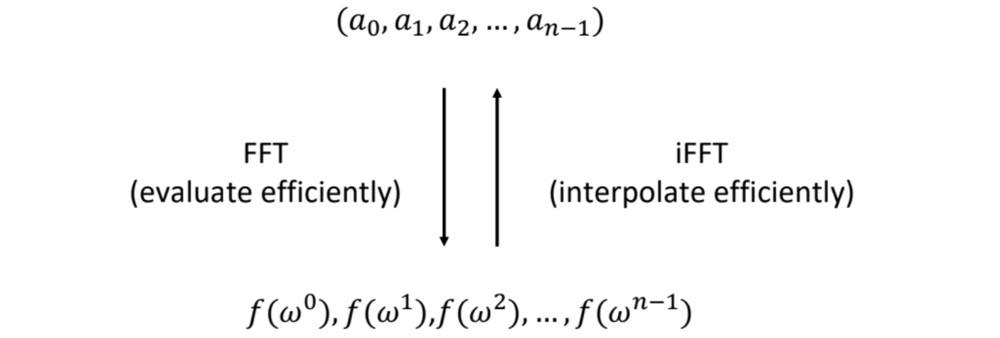

## Math for ZKP

### group

#### cycilc group

在抽象代数中，一个循环群或单生成群是由单个元素生成的群。也就是说，它是一组可逆元素，具有单一的关联二元运算，并且它包含一个元素 g，使得通过反复将群运算应用于 g 或其逆可以得到群的每个其他元素。每个元素都可以写成 g 的整数次幂（在乘法表示法中），或者写成 g 的整数倍（在加法表示法中）。这个元素 g 被称为群的生成元。

对于有限循环群 G，其阶为 n，我们有 G = {e, g, g², …, gⁿ⁻¹}，其中 e 是单位元素，当 i ≡ j (mod n) 时，有 gᵢ = gⱼ1。特别地，gⁿ = g⁰ = e，且 g⁻¹ = gⁿ⁻¹1。

循环群性质：

* **阿贝尔性**：每个循环群都是阿贝尔群（意味着其群运算是可交换的）。
* **生成元的逆元也是生成元**：如果一个元素是生成元，那么它的逆元也是生成元。
* **素数阶的循环群是简单群**：不能被分解为更小的群。

#### Pedersen hash

Pedersen Hash 是一种安全的哈希函数，它将一系列的比特映射到椭圆曲线上的一个压缩点1。这种哈希函数主要用于零知识证明的算术电路中，以及其他需要安全哈希函数的通用用途1。
Pedersen Hash 的计算过程分为三个阶段：

* **初始化阶段**：选择大素数 q 的乘法群 G、生成元，公开元组 (g，h，q)；

* **承诺阶段**：承诺方选择随机数 r 作为盲因子，计算承诺值，然后发送 comm 给接收者；

* **打开阶段**：承诺方发送 (v，r) 给接收者，接收者验证 comm 是否等于  
  $$
  g^vh^v mod    q
  $$
  ，如果相等则接受，否则拒绝承诺。

Pedersen Hash 具有完美隐藏性（unconditionally hiding）特性，以及基于离散对数假设的完美隐藏性（computationally binding）特性2。这意味着，即使承诺的生成者公开了 r，其他任何人也无法从承诺中获得正确的 v2。
此外，Pedersen Hash 还具有加法同态性2。如果 comm1 和 comm2 分别是使用盲因子 r1 和 r2 对 v1 和 v2 的承诺，那么 comm (comm = comm1 * comm2) 是使用盲因子 r1 + r2 对 v1 + v2 的承诺2。
总的来说，Pedersen Hash 是一种在密码学中广泛使用的工具，特别是在构建零知识证明和 Merkle 树等数据结构时

### rings

环（Ring）是一种在抽象代数中的基本概念，它是一种包含两种运算（通常被称为**加法**和**乘法**）的代数结构。环的定义类似于交换群，只不过在原来「+」的基础上又增添另一种运算「⋅」。

环的定义如下：

**一个环是一个配备了两种二元运算的集合。这两种运算被称为加法和乘法**，通常用 “+” 和 “·” 表示，例如 a + b 和 a · b。
为了形成一个环，这两种运算必须满足一些性质：

* 环必须是在加法下的阿贝尔群，以及在乘法下的幺半群，
* 其中乘法对加法有分配性，即 a · (b + c) = a · b + a · c。

环的一些例子包括：

1. 整数环：整数环是一个重要的例子，其中的两种运算是整数的加法和乘法。由于整数的乘法是可交换的，所以这是一个交换环。
2. 多项式环：如果 R 是一个给定的交换环，那么所有系数在 R 中的变量 x 的所有多项式构成了多项式环2。

#### Commutative Rings

在数学中，交换环是一种环，其中**乘法运算是可交换的**。这意味着，对于环中的任何两个元素 a 和 b，都有 ab = ba。

交换环的定义如下：

**一个环是一个配备了两种二元运算（即将环中的任何两个元素组合成第三个元素的运算）的集合。这两种运算被称为加法和乘法，通常用 “+” 和 “·” 表示，例如 a + b 和 a · b**。
为了形成一个环，这两种运算必须满足一些性质：环必须是在加法下的阿贝尔群，以及在乘法下的幺半群，其中乘法对加法有分配性，即 a · (b + c) = a · b + a · c。
加法和乘法的单位元分别被记作 0 和 1。如果乘法是可交换的，即对于所有的 a 和 b，我们有 a · b = b · a，那么这个环就被称为交换环。

交换环的一些例子包括：

1. 整数环：整数环是一个重要的例子，其中的两种运算是整数的加法和乘法。由于整数的乘法是可交换的，所以这是一个交换环。
2. 多项式环：如果 R 是一个给定的交换环，那么所有系数在 R 中的变量 x 的所有多项式构成了多项式环1。
   域：域是一个每个非零元素都有乘法逆元的交换环，即对于每个非零元素 a，都存在一个元素 b，使得 a · b = 1。因此，**任何域都是一个交换环**

### Fields

在数学中，域（Field）是一种非常重要的概念，它是数学中的一种代数结构，具有广泛的应用。

域可以被理解为一种有序的**数学对象集合**，其中包含**加、减、乘、除**四种运算，并满足一定的公理。

域的定义如下：

一个域是一个**集合**，它配备了两种二元运算：**加法和乘法**。
这个集合在加法下形成一个**阿贝尔群**（交换群），且其**单位元为0**。
集合中去掉0的部分在乘法下也形成一个阿贝尔群，且其单位元为1。
乘法对加法满足分配律，即对所有的 a, b, c，有 a · (b + c) = a · b + a · c。
域的一些例子包括：

1. 有理数域：全体有理数的集合，与其加法和乘法构成一个域。
2. 实数域：全体实数的集合，与其加法和乘法构成一个域。
3. 复数域：全体复数的集合，与其加法和乘法构成一个域。
4. 有限域：元素个数是一个素数q的乘方的域，记作 Fq，也称为伽罗瓦域。

####  **Prime fields**

质数域，也被称为素域，是一种特殊的域，它不包含任何真子域1。换句话说，素域是一个只包含有限个元素的域，且这些元素的数量是一个质数。

素域的定义如下：

* 对于任何一个域 F，我们都有单位元 e。考虑加群 {0，±e，±2e，…，±me，…}，它有两种可能：
* 对于任意非零整数 m，如果 me ≠ 0，那么 S = {ne/me | m，n 为整数，m ≠ 0} 是 F 的子域且同构于有理数域。此时，称 F 的特征数为零1。
* 如果存在正整数 m，使得 me = 0，那么 p 是使得 pe = 0 的最小正整数，p 必为素数，我们称 p 为 F 的特征数1。如果 S = {0，e，…， (p-1)e}，那么 S 是 F 的子域且与整数环模 p 的域同构。当 F = S 时，称 F 是素域1。因此，任意域都包含有一个素子域

####  **Projective Planes**

在数学中，射影平面（Projective Plane）是一种几何结构，它扩展了平面的概念。在普通的欧几里得平面中，**两条线通常会在一个点相交，但有些线（即平行线）不会相交**。射影平面可以被认为是一个带有额外的“无穷远点”的普通平面，平行线会在这个点相交。因此，在射影平面中，任何两条不同的线都会在恰好一个点相交。

射影平面的定义如下：

射影平面由一组线、一组点和一种称为“关联”的点线关系组成，满足以下性质：

* 给定任意两个不同的点，存在恰好一条与它们都关联的线。

* 给定任意两条不同的线，存在恰好一个与它们都关联的点。
  存在四个点，没有一条线与其中超过两个点关联。

  

射影平面的一些例子包括

扩展的欧几里得平面：这是最典型的例子，也被称为实射影平面。
复射影平面：所有复数的集合，与其加法和乘法构成一个射影平面。
Fano平面：这是最小的有限射影平面，它有7个点和7条线

### **Elliptic Curves**

特性：

(o^^o)

* **形式**： 在不等于2的域上，椭圆曲线的仿射方程：
  $$
  y^2 = x^3 + ax + b
  $$
  其中a，b 是常数，切满足：
  $$
  4a^3 + 27 b^2 != 0
  $$
  这是保证曲线光滑，没有重根。

* **对称性**： 椭圆曲线关于x轴对称。

* **群结构**：椭圆曲线上的点可以构成一个群，群运算被定义为点的加法。P +Q = R

* **阶**：椭圆曲线上点的数量，在有限域的椭圆曲线，其阶是有限的。

* **无穷远点**：除了在坐标系上的点外，椭圆曲线还额外定义了一个无穷远点，记为O，这个点在群运算中起到了单位元的作用。

* **复数域上的图像**：复数域上的椭圆曲线可以看成复平面模掉一格，也就是一个环面。

例：

* Bitcoin’s secp256k1 curve.    2^256
  $$
  secp256k1 = {(x, y) ∈ Fp ×Fp | y
  2 = x
  3 +7 }
  $$

* Ethereums’s alt_bn128 curve 2^254 
  $$
  alt_bn128 = {(x, y) ∈ Fp ×Fp | y
  2 = x
  3 +3 }
  $$

椭圆曲线压缩是一种在计算机中表示椭圆曲线上点的方法。椭圆曲线上的任一仿射点 (x, y)（非无穷远点）都可以压缩成利用其y坐标的最后一比特（记为y*）和x坐标来表示，即 (x, y*)，这就是点的压缩。 反过来，利用 (x, y*)恢复y坐标，还原仿射点 (x, y)的过程就称为点的解压缩。

椭圆曲线的一个关键性质是，可以在它的点的集合上定义一个群律，使无穷远处的点作为中性元素，逆是重新定义的 x轴上的折变。

弦和切线的代数定义。

弦：在圆或椭圆中，弦是连接两个点的直线段1。在代数形式中，如果我们有一个圆的方程
$$
x^2+y^2=r^2
$$
，其中 (x1,y1) 和 (x2,y2) 是圆上的两点，那么这两点之间的弦的方程可以通过两点式方程 
$$
(y−y1)/(x−x1)=(y2−y1)/(x2−x1)
$$

 得到。

切线：切线是与曲线在某一点接触但不穿过曲线的直线。在代数形式中，如果我们有一个函数 f(x) 和它在点 (x0,f(x0)) 的导数 f′(x0)，那么这一点处的切线的方程可以通过切线方程 y=f(x0)+f′(x0)(x−x0)
 得到。

蒙哥马利曲线是一类特殊的椭圆曲线，其在密码学中有广泛的应用，特别是在椭圆曲线密码学中1234。
蒙哥马利曲线的一般形式定义为：
$$
By^2=x^3+Ax^2+x
$$
其中，A 和 B 是定义在有限域 K 上的系数，且满足条件 B(A2−4)\\=0

例： Curve25519   曲线定义在素数域 p=2^(255)−19

Twisted Edwards Curves 是一类特殊的椭圆曲线，它是 Edwards 曲线的一种推广，由 Bernstein, Birkner, Joye, Lange 和 Peters 在 2008 年引入。
Twisted Edwards Curves 的一般形式定义为：
$$
ax^2+y^2=1+dx^2y^2
$$
其中，a 和 d 是定义在有限域 K 上的系数，且满足条件 a\\=d 和 a,d\\=0

**椭圆曲线对**：在椭圆曲线密码学中，`对` 指的是椭圆曲线上的两个点（P，Q），对两个点进行各种运算（P+Q，PQ）

**米勒循环**：计算椭圆曲线配对的关键步骤，配对是一种特殊的二元运算，**它接受两个椭圆曲线上的点，并返回一个目标群中的元素**。米勒循环是**计算配对**的主要部分，它涉及到一系列复杂的椭圆曲线运算。

曲线嵌入度（**Embedding Degrees**）：假定曲线E，定义在有限域Fq，该曲线的阶（椭圆曲线点的数量）n，曲线的嵌入度K满足
$$
n|q^k -1
$$
的最小整数，嵌入度K使得n能够整除 q^k -1 的最小的k，

曲线嵌入度决定的椭圆曲线群到有限域的映射（配对）的效率，若K太大，则映射效率会非常低，使得配对密码系统在实际中难以使用。

 **Full torsion groups**：“Full Torsion Groups” 在密码学中通常指的是椭圆曲线上的所有点的集合，这些点的阶（即，通过椭圆曲线群运算重复添加自身的次数）是有限的。

在椭圆曲线密码学中，通常关注的是椭圆曲线上的点的阶是素数的情况，因为这样的点生成的子群有很好的性质，例如，它们是循环的。然而，椭圆曲线上也可能存在阶为合数的点，这些点和它们的倍数构成的集合就是所谓的 “Full Torsion Groups”。

**配对组**：**Pairing groups** 特殊的二元运算，接受椭圆曲线上的两个点，返回一个目标群中的元素，常用的是**Tate 配对**和**Weil配对**。他们的作用是根据加法群G1 G2 中的一个元素，进行高效映射，生成乘法群G的一个元素。

**Weil 配对**：简单的说，Weil 配对可以将椭圆曲线之挠群（torsion group）上的两个点，映射到一个特殊有限域之**乘法子群**上，借此可将**椭圆曲线离散对数问题（ECDLP）投射到一般的离散对数问题（DLP）**。

#### 构造椭圆曲线

复数乘法方法：（**Complex Multiplication Method**） 复数乘法理论主要研究的是具有比整数环更大的端点环的椭圆曲线1。换句话说，它包含了具有额外对称性的椭圆函数的理论，例如当周期格为高斯整数格或艾森斯坦整数格时可见的对称性。

大素数阶子群：群的阶是指群中元素的数量。如果一个群的阶是一个素数，那么这个群就被称为素数阶群。素数阶群有一个重要的性质，那就是它们一定是**循环群**。

在密码学中，特别是在椭圆曲线密码学中，我们通常关注的是椭圆曲线上的点的阶是大素数的情况。这样的点生成的子群有很好的性质，例如，它们是循环的。这种子群就被称为"大素数阶子群"

#### R1CS

Rank-1 Constraint System (R1CS) 是一种用于**描述和验证**计算的框架。

在 R1CS 中，跟踪所有变量在计算过程中可以持有的所有值，并约束所有由计算本身暗示的变量之间的关系。一旦约束了计算机程序所有步骤之间的关系，那么程序执行就被强制以完全预期的方式进行计算，没有任何偏离的机会。因此，R1CS 的解就是正确程序执行的证明。

#### **Algebraic Circuits**

R1CS是二次方程，因此解是相关语言中单词存在的知识证明。 因此，从一个证明器的角度来看，有效地**求解**这些方程是很重要的。

计算R1CS解的方法有时被称为 **witness generator functions**。 每个代数电路都定义了一个相关的R1CS，并提供了一个系数。

将高级计算机程序转换为这些电路是一个通常被称为拍平（**flattening**）的过程

有向无环图（Directed Acyclic Graph，简称 DAG）和代数电路之间有着密切的关系123。

**有向无环图**：在计算机科学和图论中，有向无环图是一种特殊类型的图，它由有限个顶点和有向边组成，从任意顶点出发，经过若干条有向边，**都无法回到该顶点**。这种图的特性使得它在表示依赖关系时非常有用，例如在计算机程序中表示数据或任务之间的依赖关系。
**代数电路**：代数电路是一种计算模型，它由输入、输出和一系列代数运算（如加法、乘法）组成。每个运算都可以看作是一个节点，每个节点的输入和输出可以看作是有向边。因此，代数电路可以被表示为一个有向无环图。
在这种情况下，有向无环图和代数电路的关系就很明显了：有向无环图提供了一种表示代数电路的方法，**每个节点代表一个运算**，每**个有向边代表数据从一个运算流向另一个运算**。这种表示方法使得我们可以清晰地看到**电路中的数据流和依赖关系**。

> 代数电路是有向的，无环多图，其中节点表示变量，常数，或加法和乘法门。特别是，每个具有n个输入节点的代数电路装饰 使用变量符号和m个带有变量的输出节点可以看作是一个函数，它将一个输入字符串（x1，...，xn）从fn转换为一个从fm的输出字符串（f1，...，fm）。这个 转换是通过沿着节点的值发送到其他节点来完成的。如果这些节点是门，那么这些值将根据门标签和pr进行转换 沿着所有的边**重复进行**，直到到达一个**汇聚节点**。我们称之为计算电路执行。

任何R1CS都可以转换为另一个称为二次算术P的计算模型  **Quadratic Arithmetic Program**  [QAP]，它是目前存在的一些最有效的简洁的非交互式零知识证明生成器的基础。

从给定的R1CS 计算QAP步骤：

* 如果 R1CS 由 k 个约束组成，首先从域 F 中选择 k 个不同的可逆元素。每个选择都为相同的 R1CS 定义了一个不同的 QAP1。

* 然后根据其定义计算目标多项式 T。

* 之后使用拉格朗日方法来计算每个 1≤j≤k的多项式 Aj
  ，从集合 
  $$
  SAj={(m1,a1j),...,(mk,akj)}
  $$
  

完成以上步骤后，对每个 1≤j≤k 执行类似的计算，以得到多项式 Bj和 Cj

R1CS编译编程语言的另一个好处是，它们不仅可以**生成R1CS表示**，还可以生成其他能够有效地**计算电路值的程序 作业这便于将电路集成到各种平台和环境中，而不需要考虑底层的实现细节。**

### 多项式

系数多项式：在系数形式中，多项式表示为变量的各个幂次的线性组合
$$
f(x) = ax^3 + bx^2 + cx 
$$
其中a,b,c 就是系数。

评估形式：在评估形式下，多项式标识为一组函数的点x,以及器对应的函数值y。这种形式常用于插值问题，如拉格朗日插值、牛顿插值。

这两种形式各有优势。系数形式便于理解和操作，特别是对于代数运算1。而评估形式则便于理解函数在特定点的行为，特别是对于数值分析和插值。

表示 Polynomial 的 2 种方式：

- coefficients form: *f*(*x*)=*a*0+*a*1*x*+*a*2*x*2+…+*a**n*−1*x**n*−1
- evaluation form: *f*(*x*)=(*x*0,*f*(*x*0)), (*x*1,*f*(*x*1)), …,(*x**n*−1,*f*(*x**n*−1))

多项式计算FFT，IFFT

* FFT：系数多项式----> 评估多项式
* IFFT：评估多项式-----> 系数多项式

> - **傅立叶变换**（Fourier transform）：从系数形式转换到评估形式的过程。简单来说，就是取一个多项式的系数，然后计算这个多项式在一组特定点上的值
> - **逆傅立叶变换**（Inverse Fourier transform）：这是相反的过程，即从评估形式转换回系数形式。它涉及到从一组特定点上的多项式值反推出原始多项式的系数

多项式乘法 **multiplication**

* iFFT(FFT(f(x)) * FFT(f(x)))
* 通过 evaluation form 相乘是比较好计算的，**只需要将相同 x 坐标的对应的 y 坐标相乘， x 坐标保持不变，从而完成多项式乘法计算。**

多项式除法：division (vanishing polynomial):

承诺 Commitment ----> Multiexp

* MSM 即将标量向量 (scalar vector) 和椭圆曲线上的点 (point vector) 做点乘。

> 在 high level 层面上，证明生成（proof generation）由 3 个阶段组成：
>
> 1. **phase 1**: 填入 `witness`
> 2. **phase 2**: commit to the `witness`
> 3. **phase 3**: prove that the witness 是正确的

**phase 1**： fill witness

`witness` (或者说 `trace`) 指的是一组数据，可以展示为什么某个 statement 是正确的。

**phase 2**: commit to the `witness` 

* 对 `witness` 的 commitment 涉及到输出 witness 的一些简洁表示 (succient representations)，并在此意义上压缩 witness。
* 在这一步中使用多项式承诺方案 (polynomial commitment scheme) 使我们能够仅通过简洁的承诺 (succinct commitment) 来证明 original witness 里 referencing 的某些属性。

**phase 3**: prove that the witness 是正确的

* `phase 1` 阶段生成的 witness 必须遵从某些特定属性才能认证为 valid
* 如若 original witness 满足了这些约束，那么一个**简短的 proof** 就可以被正常生成
* 验证 proof 不需要访问 original witness table - 验证可以做到仅参考在 **phase 2** 生成的 succinct commitment 来进行。

