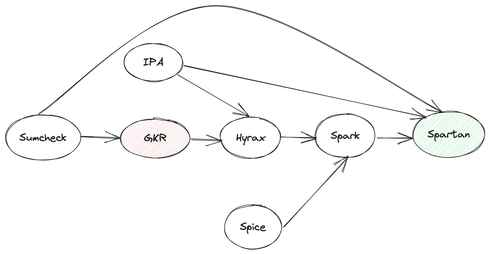
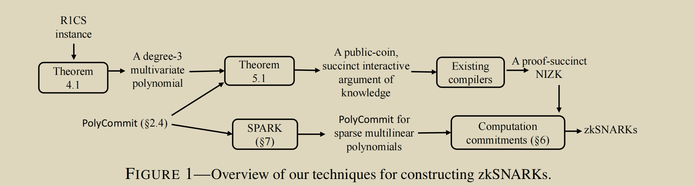

# Spartan: 高效透明的 zkSNARK



## 1. 概述

Spartan 是一种新型的 zkSNARK 技术，为算术可满足性关系（R1CS）提供了高效的零知识证明系统，支持 NP 完备语言。它在透明性、效率和可扩展性方面取得了显著突破。

### 1.1 主要特点

* **无需信任的设置**：Spartan 是一种透明的 zkSNARK，不需要可信设置。因此，它不涉及任何必须保密的陷阱门，也不需要多方计算仪式来产生公共参数。

* **通用性**：Spartan 可以为任意 NP 语句生成证明。libspartan 支持以 R1CS 实例表达的 NP 语句，这是一种流行的语言，存在从高级程序到目标程序的高效转换和编译工具链。

* **次线性验证成本**：Spartan 是首个对于任意 NP 语句（例如，R1CS）具有次线性验证成本的透明证明系统。

* **标准化的安全性**：Spartan 的安全性依赖于在随机预言模型中计算离散对数的难度。

### 1.2 性能优势

在透明 SNARKs 中，Spartan 相比基线方案提供了：
- 证明生成速度提高了 36-152 倍
- 生成的证明更短，为 1.2-416 倍
- 验证时间最低，速度提高了 3.6-1326 倍

## 2. 预备知识

### 2.1 GKR 协议

**GKR**（Goldwasser-Kalai-Rothblum）是一种零知识证明协议，用于验证某方拥有某些信息，而不泄露具体数据内容。具体来说，**GKR** 协议是 **Sumcheck** 协议的一种应用，**用于证明多个电路的输出结果**。

#### 2.1.1 数据并行化下的 GKR 协议

1. **数据并行化 GKR**：
   - 在数据并行化下，同一个电路描述应用在多组输入数据中的 **GKR** 协议
   - 在 GKR 协议中，prover 需要证明的**不再是单一的电路输出，而是多个子电路的输出的汇总**

2. **协议步骤**：
   - **Step Zero**：public inputs 以及 witness 提交
   - **Step One**：Prover 发送电路的 **outputs 作为 Sumcheck 的初始声明**，Verifier 根据给定电路第 0 层的评估值插值出相应的多项式
   - **Step Two**：进入第 1 层电路的 Sumcheck 协议，**Prover 需要证明多项式的正确性**
   - **Step Three**：继续进行多轮的验证，直到最后一轮
   - **Last Round**：Verifier 使用多项式的 commitment 完成第 1 层电路 Sumcheck 协议的最后验证

### 2.2 SumCheck 协议

SumCheck 是一种用于零知识证明的交互式协议，用于证明多变量多项式在所有可能的布尔输入上的和等于某个特定值。

SumCheck 协议的基本流程：
1. Prover 声明多项式 $f(x_1, x_2, ..., x_n)$ 在所有布尔输入上的和为 $C$
2. Verifier 要求 Prover 证明这个声明
3. 协议通过 $n$ 轮交互进行，每轮处理一个变量
4. 最终，Verifier 只需要在一个随机点评估多项式，大大减少了验证工作量

更多详情可参考：[一文了解零知识证明当中的 Sum-check Protocol](https://foresightnews.pro/article/detail/24351)

## 3. Spartan 核心技术

Spartan 在零知识证明（ZKP）中的实现，主要依赖于以下几种新的技术，达到**无需可信设置**的目的：

### 3.1 计算承诺（Computation Commitments）

计算承诺是一种创建对计算描述的简洁承诺的原语。这种技术对于验证者在投入一次性的公共计算来预处理给定的 NP 语句后实现次线性成本至关重要。

在 Spartan 中：
- 验证者读取一个 R1CS 实例（没有 IO 组件），为此产生了证明
- 验证者保留了对一组稀疏多线性多项式编码 R1CS 结构的短密码承诺
- 证明者计算必要的多项式，并证明稀疏多项式计算与验证者保留的承诺是一致的
- 验证者在计算承诺时产生 O(n) 成本，但这个成本可以摊销到所有具有相同结构的 R1CS 实例产生的所有未来证明
- 这种摊销类似于 GGPR，但与 GGPR 的可信设置不同，创建计算承诺不涉及任何秘密陷阱门

### 3.2 SPARK

SPARK 是一种密码学编译器，用于将任何现有的可提取的多项式承诺方案转换为有效处理稀疏多项式的方案。这种技术对于实现时间最优证明者至关重要。

**Spark** 是 Spartan 整个协议的核心部分，而 **Memory Check** 是 Spark 的核心部分，**VSM** 则是 Memory Check 或 Spice 的核心部分。



### 3.3 R1CS 实例的紧凑编码

Spartan 将 R1CS 实例编码为低度多项式，具体来说是一个 3 次多元多项式，可以分解为四个多线性多项式。分解成多线性多项式是利用先验思想，在求和校验协议中得到一个时间最优证明器。

## 4. 可验证状态机（VSM）

### 4.1 VSM 概念

VSM，全称 **Verifiable State Machine**，这个概念源自 Spice。

把任何一个 storage 对象当作一个 State Machine，在这个 State Machine 上的任何 operation 导致其 state 的 transition 都可以生成相应的 proof 给 verifier 验证。这就是所谓的 Verifiable State Machine。


### 4.2 VSM 特性

- **Spice 的特性**：
  - **批量验证**：n 个 operation 之后一起验证，成本会**平摊**到每个 operation 上，所以成本会很低，但会有时间上的延迟
  - **验证局限性**：如果验证不通过，无法判断哪个 operation 出的问题

- **Storage 结构**：
  - Storage 作为三方一个独立存在的个体
  - state 通常以 **key-value-timestamp** 的格式出现
  - 相比传统的 key-value 的 Storage，增加了可以**表征 State Machine 的关键元素 Timestamp**

### 4.3 VSM 工作流程

- **Prover 操作**：
  - Prover 自身维护两个 set state $RS$ 和 $WS$
  - 发送一个 query/read operation 会更新本地的这两个 set state $RS$ 和 $WS$，并 update Storage 的 state $Audit$
  - 发送一个 write operation 会更新本地的 state $WS$，并 update Storage 的 state $Audit$

- **Verifier 验证**：
  - Verifier 拿着更新前的 state $Init$，和更新后的 state $Audit$
  - 结合 operation 过程产生的中间 state 或 proof $RS/WS$，进行最后的验证
  - 验证通过说明返回的结果没有问题

## 5. Memory Check for Spartan

### 5.1 基本概念

Spice 支持读、写操作的验证，而 Spark 中只需要具备 lookup 功能的验证，所以可以简单理解为 read-only 版本的 Spice。

### 5.2 查询过程

query 的过程：给定 $rowaddr/coladdr$ 向量中的某个元素值，返回相应 table 中 evaluation 值。

### 5.3 批量查询验证

1. 批量 query 之前，verifier 请求拿到 $memrow$ 的初始 State $Init_{row}$
2. 批量 query $addr_{row}$
3. verifier 请求得到 $memrow$ 的最新 State $Audit_{row}$
4. 结合 prover 传递过来的 proof $RS_{row}/WS_{row}$ 进行最后的验证：

$$Init_{row} \cup WS_{row} \stackrel{?}{=} Audit_{row} \cup RS_{row}$$

## 6. 技术实现细节

### 6.1 多项式承诺方案

Spartan 使用了基于离散对数的多项式承诺方案，具体包括：

1. **Setup**：生成公共参数，包括群生成元和随机元素
2. **Commit**：对多项式进行承诺，生成一个简洁的承诺值
3. **Open**：证明某个点上多项式的评估值
4. **Verify**：验证评估值的正确性

Spartan 的多项式承诺方案具有以下特点：

- **批量验证**：可以高效地验证多个多项式在多个点的评估值
- **零知识性**：不泄露多项式的其他信息
- **可提取性**：从承诺中可以提取出唯一的多项式

### 6.2 R1CS 到多项式的转换

Spartan 将 R1CS 约束转换为多项式形式，具体步骤如下：

1. 将 R1CS 矩阵表示为稀疏形式
2. 为每个非零元素分配一个索引
3. 构造编码矩阵结构的多线性多项式
4. 使用 SPARK 技术高效处理这些稀疏多项式

转换后的多项式满足以下等式：

$$\sum_{i,j} A_{i,j} \cdot z_i \cdot z_j = \sum_{i,j} B_{i,j} \cdot z_i \cdot z_j \cdot \sum_{i,j} C_{i,j} \cdot z_i \cdot z_j$$

其中 $A$, $B$, $C$ 是 R1CS 约束矩阵，$z$ 是包含输入和中间变量的向量。

### 6.3 SumCheck 协议的优化

Spartan 对 SumCheck 协议进行了多项优化：

1. **批处理技术**：同时处理多个 SumCheck 实例
2. **预计算**：对常用值进行预计算，减少在线计算开销
3. **并行化**：利用多核处理器加速计算
4. **内存优化**：减少中间值存储，降低内存需求

这些优化使得 Spartan 的 SumCheck 协议比传统实现快数倍。

## 7. 实现与代码分析

### 7.1 libspartan 库概述

libspartan 是 Spartan 协议的参考实现，使用 Rust 语言编写。主要组件包括：

- **R1CS**：表示和处理 R1CS 约束系统
- **PolyCommit**：多项式承诺方案实现
- **SumCheck**：SumCheck 协议实现
- **Prover**：证明生成器
- **Verifier**：证明验证器

### 7.2 核心数据结构

```rust
// R1CS 实例表示
pub struct R1CSInstance<G: Group> {
    pub(crate) num_cons: usize,
    pub(crate) num_vars: usize,
    pub(crate) num_inputs: usize,
    pub(crate) A: SparseMatrix<G::Scalar>,
    pub(crate) B: SparseMatrix<G::Scalar>,
    pub(crate) C: SparseMatrix<G::Scalar>,
}

// 多项式承诺
pub struct PolyCommitment<G: Group> {
    pub(crate) comm: G,
    pub(crate) degree: usize,
}

// 证明结构
pub struct Proof<G: Group> {
    pub(crate) comm_witness: PolyCommitment<G>,
    pub(crate) sumcheck_proofs: Vec<SumCheckProof<G::Scalar>>,
    pub(crate) eval_proofs: Vec<EvaluationProof<G>>,
}
```
### 7.3 性能优化技术
libspartan 实现了多种性能优化技术：

1. 多线程并行计算 ：利用 Rayon 库实现并行计算
2. 批量指数运算 ：使用窗口方法加速椭圆曲线运算
3. FFT 优化 ：使用优化的 FFT 算法加速多项式运算
4. 内存池 ：重用内存分配，减少垃圾回收开销
这些优化使得 libspartan 在实际应用中具有良好的性能。

## 8. 安全性分析
### 8.1 安全性假设
Spartan 的安全性基于以下假设：

1. 离散对数假设 ：在给定的群中，计算离散对数是困难的
2. 随机预言机模型 ：哈希函数被建模为随机预言机
3. 知识可靠性假设 ：如果证明者能够生成有效证明，则它必须知道相应的见证
### 8.2 安全性证明
Spartan 提供以下安全性保证：

1. 完备性 ：诚实的证明者总能说服诚实的验证者
2. 可靠性 ：恶意证明者无法说服验证者接受错误的语句
3. 零知识性 ：验证者从证明中获取不到除了语句正确性之外的任何信息
4. 知识可靠性 ：从能够生成有效证明的证明者中可以提取出见证


