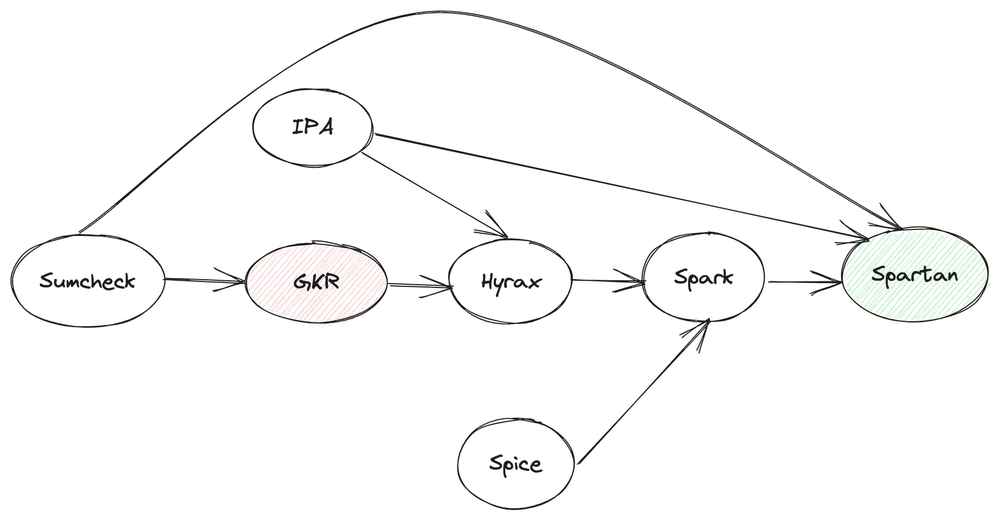

> ### 预备知识
>
> **GKR**（Goldwasser-Kalai-Rothblum）是一种零知识证明协议，用于验证某方拥有某些信息，而不泄露具体数据内容。具体来说，**GKR** 协议是 **Sumcheck** 协议的一种应用，**用于证明多个电路的输出结果**。
>
> 数据并行化下的GKR协议：
>
> 1. 数据并行化GKR：
>    1. 在数据并行化下，同一个电路描述应用在多组输入数据中的 **GKR** 协议。
>    2. 在GKR协议中，prove需要证明的**不再是单一的电路输出，而是多个子电路的输出的汇总。**
> 2. 协议步骤：
>    1. Step Zero： public inputs 以及 witness 提交
>    2. Step One：Prover 发送电路的**outputs作为 Sumcheck 的初始声明，**Verifer 根据给定电路第 0 层的评估值插值出相应的多项式**。
>    3. Step Two： 进入第 1 层电路的 Sumcheck 协议，**Prover 需要证明多项式的正确性**。
>    4. Step Three： 继续进行多轮的验证，直到最后一轮。
>    5. Last Round： Verifer 使用多项式的 commitment 完成第 1 层电路 Sumcheck 协议的最后验证。
>
> SumCheck 一种用于零知识证明的交互式协议。
>
> [一文了解零知识证明当中的 Sum-check Protocol - Foresight News](https://foresightnews.pro/article/detail/24351)

SPartan 是一种新型的zk-snark技术，他是一种概括算术可满足行的np完备语言。

Spartan 的独特之处在于：

* **无需信任的设置**：Spartan 是一种透明的 zkSNARK，不需要信任的设置。因此，它不涉及任何必须保密的陷阱门，也不需要多方仪式来产生公共参数

* **通用性**：Spartan 可以为任意 NP 语句生成证明。libspartan 支持以 R1CS 实例表达的 NP 语句，这是一种流行的语言，存在从高级程序到感兴趣的程序的高效转换和编译工具链

* **次线性验证成本**：Spartan 是第一个对于任意 NP 语句（例如，R1CS）具有次线性验证成本的透明证明系统3。

* **标准化的安全性**：Spartan 的安全性依赖于在随机预言模型中计算离散对数的难度3。

  

  在透明 SNARKs 中，Spartan 提供了最快的证明者，根据基线，速度提高了 36-152 倍，生成的证明更短，为 1.2-416 倍，并且验证时间最低，速度提高了 3.6-1326 倍

Spartan在零知识证明（ZKP）中的实现，主要依赖于以下几种新的技术，达到**无需可信设置**的目的：

* **计算承诺**（Computation Commitments）：这是一种创建对计算描述的简洁承诺的原语。这种技术对于验证者在投入一次性的公共计算来预处理给定的NP语句后实现次线性成本至关重要。
* **SPARK**：这是一种密码学编译器，用于将任何现有的可提取的多项式承诺方案转换为有效处理稀疏多项式的方案。这种技术对于实现时间最优证明者至关重要。
* **R1CS实例的紧凑编码**：将R1CS实例编码为低度多项式。
  最终的结果是一个公币的简洁的交互式知识论证，用于NP（可以视为sum-check协议的简洁变体）；我们使用先前的技术将其转换为zkSNARK1[1]22。

通过将SPARK应用于不同的承诺方案，我们得到了几个zkSNARKs，其中验证者的成本和证明大小范围从O(log2 n)到O(n)，取决于底层的承诺方案（n表示NP语句的大小）

> 计算承诺，一个用于创建简洁的加密网络的原语，提交给NP语句的数学描述，这对于实现亚线性验证成本至关重要。
>
> 在spartan中，验证者读取一个R1CS实例 （没有io组件），为此产生了证明，并保留了对一组稀疏多线性多项式编码R1CS结构的短密码承诺。
>
> 然后，在产生一个证明时，证明者计算必要的多项式，并证明稀疏多项式计算与验证者保留的承诺是一致的。而 验证者在计算计算承诺时产生O (n)成本，成本摊销为所有具有相同结构的R1CS实例产生的所有未来证明。这种摊销类似于那个 GGPR 。然而，与GGPR的可信设置不同，创建一个计算承诺不涉及任何secret trapdoors.
>
> SPARK，**一种密码编译器**，将任何现有的多线性多项式承诺方案转换为一个有效处理稀疏多线性多项式的方案
>
> 一个R1CS实例的**紧凑编码**为一个3次多元多项式，可以分解为四个多线性多项式。分解成多线性多项式是对a 利用先验思想，在求和校验协议中得到一个时间最优证明器。
>
> **Spark** 是Spartan 整个协议的core part，**Memory Check**是Spark 的core part，而**VSM**又是Memory Check或者Spice的core part。
>
> VSM，全称**Verifiable State Machine**，这个概念源自Spice。
>
> 把任何一个storage 对象当作一个State Machine，在这个State Machine上的任何operation 导致其state 的transition 都可以生成相应的proof 给verifier 验证。这就是所谓的Verifiable State Machine。
>
> 
>
> TIPS:
>
> - Spice 有两个drawback 或者特性：其一，**批量验证**，也就是n 个operation之后一起验证，成本会**平摊**到每个operation上，所以成本会很低，但会有时间上的delay；其二，如果验证不通过，是无法判断哪个operation 出的问题
>
> - Storage 作为三方一个独立存在的个体，state 通常以**key-value-timestamp**的格式出现，它相比传统的key-value 的Storage 的区别就是加了一个可以**表征State Machine的非常关键元素Timestamp**
>
> - Prover 自身维护两个set state 𝑅𝑆*RS* 和 𝑊𝑆*W**S*，发送一个query/read operation 会更新本地的这两个set state 𝑅𝑆*RS* 和 𝑊𝑆*W**S*，并update Storage的state 𝐴𝑢𝑑𝑖𝑡*A**u**d**i**t* ，发送一个write operation 会更新本地的state 𝑊𝑆*W**S*，并update Storage 的state 𝐴𝑢𝑑𝑖𝑡*A**u**d**i**t*
>
> - Verifier 拿着更新前的state 𝐼𝑛𝑖𝑡*I**ni**t*，和更新后的state 𝐴𝑢𝑑𝑖𝑡*A**u**d**i**t*，以及operaton 过程产生的中间state 或者proof 𝑅𝑆/𝑊𝑆*RS*/*W**S*，进行最后的验证，验证通过说明返回的结果没有问题。
>
> memory check for spartan
>
> Spice 支持读、写操作的验证，而Spark 中只需要具备lookup 功能的验证，所以可以简单理解为read-only 版本的Spice。
>
> query 的过程：给定𝑟𝑜𝑤𝑎𝑑𝑑𝑟/𝑐𝑜𝑙𝑎𝑑𝑑𝑟*ro**w**a**dd**r*/*co**l**a**dd**r* 向量中的某个元素值，返回相应table 中evaluation值。
>
> 批量query 之前，verifier 请求拿到𝑚𝑒𝑚𝑟𝑜𝑤*m**e**m**ro**w* 的初始State 𝐼𝑛𝑖𝑡𝑟𝑜𝑤*I**ni**t**ro**w*；批量query 𝑎𝑑𝑑𝑟𝑟𝑜𝑤. verifier 请求得到𝑚𝑒𝑚𝑟𝑜𝑤*m**e**m**ro**w* 的最新State 𝐴𝑢𝑑𝑖𝑡𝑟𝑜𝑤*A**u**d**i**t**ro**w*，再结合prover 传递过来的proof 𝑅𝑆𝑟𝑜𝑤/𝑊𝑆𝑟𝑜𝑤*R**S**ro**w*/*W**S**ro**w* 进行最后的验证：
> $$
> 𝐼𝑛𝑖𝑡𝑟𝑜𝑤∪𝑊𝑆𝑟𝑜𝑤=?𝐴𝑢𝑑𝑖𝑡𝑟𝑜𝑤∪𝑅𝑆𝑟𝑜𝑤*Init**ro**w*∪*W**S**row*=?*Auditrow*∪R**Srow*
> $$
> PS:
>
> * Spark不再用矩阵表达了，而是换作三个向量来表达
> * Spark 改变了MLE evaluation 的多项式
>

