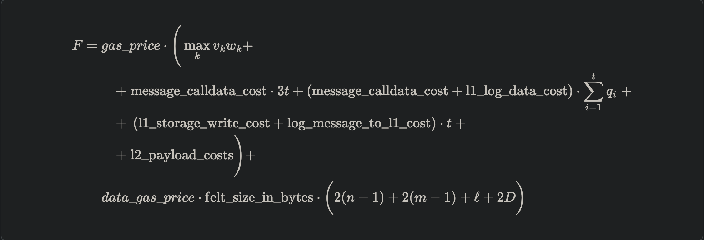
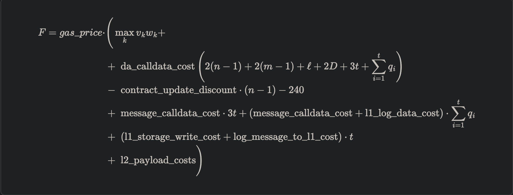

## Starknet

[文档](https://docs.starknet.io/)

Starknet 是一个无需许可的 Validity-Rollup，也称为以太坊的零知识汇总（ZK rollup）

Starknet旨在通过使用STARK密码证明系统来实现安全、低成本交易和高性能。 Starknet 合约和 Starknet 操作系统是用 Cairo 编写的，这是一种定制的专用编程语言。

组件：

* sequencers: 排序器接收交易、对它们进行排序并生成区块。它的运作方式与以太坊或比特币中的验证器类似。
* provers:为创建的区块和交易生成证明。它使用 Cairo 虚拟机 (Cairo VM) 运行可证明的程序，从而创建生成 STARK 证明所需的执行跟踪。
* nodes:

流程：

当网关（充当内存池）收到交易时，Starknet 开始工作。该阶段也可以由sequenncers管理。该交易最初标记为“已接收”。然后，sequencers将tx合并到网络状态中，并将其标记为 ACCEPTED_ON_L2。最后一步涉及prover，它在新区块上执行操作系统，计算其证明，并将其提交给第 1 层 (L1) 进行验证。

### Sequencers

类似于eth的 validator，将交易引入到starknet中。 将多个交易排序成一个批次，执行这些交易，生成一个区块，随后由证明者证明，并作为一个单一、紧凑的证明提交给L1网络。

排序器的工作：

*  `Sequencing`: 收集用户的交易并对其进行排序。
* `Executing`:排序器处理这些事务
* `Batching`: 为了提高效率，交易被分批分组在一起
* `Block Production`:排序器生成包含批量处理交易的块。

### provers

主要任务是在收到排序器生成的区块时，验证排序器的工作，并生成证明，证明这些过程是正确执行的。

职责：

* **Receives blocks**：证明者从定序器接收已处理交易的块
* **Processes blocks**：证明者第二次处理这些块，确保块内的所有交易都得到正确处理。
* **Generates a proof**：处理后，证明者生成正确交易处理的证明。
* **Sends the proof to Ethereum**：最后，证明被发送到以太坊网络进行验证。如果证明正确，以太坊网络就会接受该交易块。

### Nodes

Starknet 节点不需要处理所有交易来维持网络状态。

### Transaction lifecycle

* **Transaction submission**:一笔交易被提交到充当内存池的网关之一，并将交易状态标记为`RECEIVED`。
* **Mempool validation**:mempool 会对交易进行初步验证，如果交易无效则拒绝执行。
* **Sequencer validation:** 排序器在执行交易之前对其进行初步验证，以确保交易仍然有效。如果交易无效，则不会继续进行。此验证阶段在内存池验证期间重复相同的验证运行。
* **Execution:** 定序器操作顺序地将所有通过初步验证的事务应用到状态。如果事务在执行过程中失败，它将包含在状态为 REVERTED 的块中。
* **Proof generation and verification:** Prover 在新区块上执行操作，计算证明，并将其传输给 L1 验证者，由 L1 验证者验证该证明。此时，L1 状态已更新以包含该tx。

### GAS && tx fee

从Starknet v0.13.1版本开始，Starknet区分了以calldata形式向L1发送状态差异的块和以blobs形式向L1发送状态差异的块。 Starknet 块头中的 l1_da_mode 属性包含了这一信息。 两个选项的计算成本相同，但与数据可用性相关的成本不同。

#### 一笔交易的总费用：

其中：

* `v`  是一个表示资源使用情况的向量，其中每项`v_k` ，对应不同的资源类型：Cairo steps 和每个内置应用程序的数量。
* `𝑤 `是 CairoResourceFeeWeights 向量。
* `n` 是更新的唯一合约的数量，其中也包括对现有合约和合约部署的类的更改，即使新部署的合约的存储未被触动。 换句话说，`n ≥ ℓ` 。 请注意，`n ≥ ℓ` 始终成立，因为收费代币合约始终在更新，不会产生任何费用。
* `𝑚` 是更新值的数量，不包括同一值的多次更新。注 `𝑚 ≥ 1` 总是成立，因为排序器的余额总是更新，这不会产生任何费用。
* `𝑡` 是发送的 L2→L1 消息的数量，其中相应的项表示为 `𝑞_1 , ... , 𝑞_𝑡` 。
* `ℓ` 是其类被更改的合约数量，这发生在合约部署和应用`replace_class`系统调用时。
* `𝐷 `如果tx类型为 `DECLARE`，则为 1，否则为 0。声明交易需要在 L1 上发布添加到状态的新类哈希和编译后的类哈希。
* L2→L1 消息传递常数：
  * `message-calldata-cost`  每 32 字节字 1124 个 Gas
  * `L1-log-data-cost`  是256 gas
  * `L1-stroage-write-cost` 是写入以太坊上新存储槽的成本，即 20,000 Gas。
  * `Log-message-to-l1-cost`  1637 gas
* `L2-payload-costs`  是通过 L2 发送的数据的 Gas 成本。这包括calldata、code和emit event。
* `felt-size-in-bytes` 是 32，这是编码单个 STARK 字段元素所需的字节数。

#### 包含calldata的总交易费用

* 以下常量的定义方式与基于 blob 的公式相同:
  * 𝑣 , 𝑤 , 𝑛 , 𝑚 , 𝑡 , ℓ , 𝐷 
  * Message-calldata-cost , l1_log_data_cost , log_message_to_l1_cost , l1_storage_write_cost
  * L2-payload-costs
* Da-calldata-cost 每个 32 字节字需要 551 个 Gas:
  * Calldata 没32字节 512gas
  * 每个word 会发送~100gas的链上hash
  * 10% 的折扣，因为排序器不会因重复更新单个块内的同一存储槽而产生额外成本
* 240 是更新发送者余额的 Gas 折扣，
* Contract-update-discounut 是 312 Gas

TX fee 用是在 L2 上执行交易时自动收取的。 Starknet OS 注入一笔与费用相关的 ERC-20 转账，金额等于支付的费用，发送者等于交易提交者，排序者作为接收者

#### Transaction Fee limits

#### v3

通过 v3 交易，用户可指定每种资源的最大数量和最高价格。 目前唯一可用的资源是 L1 gas。

#### < v3

早期版本中则是用户可以自定义最大 的txfee，但是不能超过限定的max-fee

