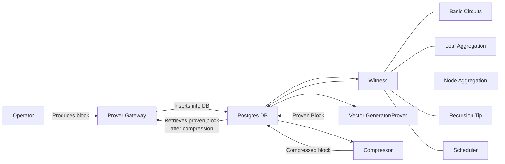

## Prover fri service

核心组件：

* Sequencer
* Prover gateway
* Witness
* Prover
* Compressor

排序器将生成区块，网关将其放入数据库进行验证。 然后，其余组件将从数据库中提取作业，并完成各自的流水线工作，从 GCS 中加载中间工件。 它们都将通过 SQL 数据库和 GCS 共享信息。





### FRI prover gateway

Prover gateway是基础设施中的一个服务组件，充当证明者和服务器的 HTTP API 之间的中介。它定期调用服务器的HTTP API来获取与证明相关的数据，并提交证明。其主要功能包括：

* **GetProofGenerationData**：该函数负责从 HTTPS API 中提取证明生成数据。它获取在我们的系统中生成证明所需的必要数据。然后，证明者将检索到的数据用作证明生成过程的输入。
* **submitProof**：一旦证明者生成证明，该函数用于将生成的证明提交回服务器。


### prover

Prover/prover_fri/src/main.rs

启动prover 分两种形式：

* 纯CPU版本的prover： 只需要启动prover 即可
  * `Prover::run` 方法启动 FRI 证明生成器。 （queue-job-processor.rs / async fn run ----> process-job 为特定的区块生成证明并验证，返回指定的证明（ZkSyncRecursionLayerProof,ZkSyncBaseLayerProof））
  
    ```rust
    #[derive(derivative::Derivative, serde::Serialize, serde::Deserialize)]
    #[derivative(Clone(bound = ""), Debug(bound = ""), Hash(bound = ""))]
    #[serde(bound = "H::Output: serde::Serialize + serde::de::DeserializeOwned")]
    pub struct Proof<F: SmallField, H: TreeHasher<F>, EXT: FieldExtension<2, BaseField = F>> {
        pub proof_config: ProofConfig,
    
        pub public_inputs: Vec<F>,
    
        pub witness_oracle_cap: Vec<H::Output>,
        pub stage_2_oracle_cap: Vec<H::Output>,
        pub quotient_oracle_cap: Vec<H::Output>,
        pub final_fri_monomials: [Vec<F>; 2],
    
        pub values_at_z: Vec<ExtensionField<F, 2, EXT>>,
        pub values_at_z_omega: Vec<ExtensionField<F, 2, EXT>>,
        pub values_at_0: Vec<ExtensionField<F, 2, EXT>>,
    
        pub fri_base_oracle_cap: Vec<H::Output>,
        pub fri_intermediate_oracles_caps: Vec<Vec<H::Output>>,
    
        pub queries_per_fri_repetition: Vec<SingleRoundQueries<F, H>>,
    
        pub pow_challenge: u64,
    
        pub _marker: std::marker::PhantomData<EXT>,
    }
    ```
  
* 启动GPU freature 的prover
  * 启动 `gpu_socket_listener::SocketListener` 监听 Witness Vector 接收 socket
  * 启动 `gpu_prover::Prover::run` 方法启动 GPU 加速的 FRI 证明生成器。
  
    ```rust
    pub struct GpuProof<A: GoodAllocator> {
        proof_config: ProofConfig,
        public_inputs: Vec<F>,
        pow_challenge: u64,
        domain_size: usize,
        num_trace_polys: usize,
        num_setup_polys: usize,
        num_arguments_polys: usize,
        num_quotient_polys: usize,
    
        query_details: Vec<Vec<u32>>,
        query_map: Vec<usize>,
        witness_oracle_cap: Vec<[F; 4]>,
        // only inner vectors needs to be located in the pinned memory
        witness_all_leaf_elems: Vec<Vec<F, A>>,
        witness_all_proofs: Vec<Vec<F, A>>,
    
        stage_2_oracle_cap: Vec<[F; 4]>,
        stage_2_all_leaf_elems: Vec<Vec<F, A>>,
        stage_2_all_proofs: Vec<Vec<F, A>>,
    
        quotient_oracle_cap: Vec<[F; 4]>,
        quotient_all_leaf_elems: Vec<Vec<F, A>>,
        quotient_all_proofs: Vec<Vec<F, A>>,
    
        setup_oracle_cap: Vec<[F; 4]>,
        setup_all_leaf_elems: Vec<Vec<F, A>>,
        setup_all_proofs: Vec<Vec<F, A>>,
    
        fri_base_oracle_cap: Vec<[F; 4]>,
        fri_base_oracle_leaf_elems: Vec<Vec<F, A>>,
        fri_base_oracle_proofs: Vec<Vec<F, A>>,
    
        fri_intermediate_oracles_caps: Vec<Vec<[F; 4]>>,
        fri_intermediate_oracles_leaf_elems: Vec<Vec<Vec<F, A>>>,
        fri_intermediate_oracles_proofs: Vec<Vec<Vec<F, A>>>,
        fri_folding_schedule: Vec<usize>,
        // last monomials doesn't need to be allocated on the pinned memory
        // since intermediate transfer uses pinned then global allocator.
        final_fri_monomials: [Vec<F>; 2],
    
        values_at_z: Vec<EF, A>,
        values_at_z_omega: Vec<EF, A>,
        values_at_z_zero: Vec<EF, A>,
    }
    ```
  
  * `gpu_prover_availability_checker::availability_checker::AvailabilityChecker` 作为可用性检查器 (检查GPU prover 的状态,依赖于配置文件 `availability_check_interval_in_secs`)。(optional)

TIP: 

* 针对不同的prover ，其底层使用的proof 生成/验证的方式不同，cpu-prover 则是使用era-zkevm-test-harness 这个repo。而GPU-prover则是使用 era-shivini （era-cuda ）这个repo 。
* 两个proof的异同点：
  * 相同点：
    * 都包含证明配置 (`proof_config`) 和公有输入 (`public_inputs`)
    * 都包含与 FRI 相关的部分，例如 oracles 的哈希值 (`fri_base_oracle_cap`, `fri_intermediate_oracles_caps`) 和最终的 FRI 单项式 (`final_fri_monomials`)
    * 都包含用于验证证明的挑战 (`pow_challenge`)
  * 不同点：
    * 数据类型：
      * **Proof:** 使用通用类型的字段元素 (`F`) 和哈希输出 (`H::Output`)，适用于 CPU 计算。
      * **GpuProof:** 使用特定于 GPU 的数据类型，例如 `ExtensionField<F, 2, EXT>` 和固定大小数组 (`[F; 4]`)，以便于在 GPU 上进行高效计算。
    * 存储结构：
      * **Proof:** 适用于通用存储，所有数据都使用标准的 Rust 向量 (`Vec`) 存储。
      * **GpuProof:** 针对 GPU 内存访问进行了优化，将需要频繁访问的数据 (`witness_oracle_cap`, `query_details`, 等) 放在固定大小的数组 (`[F; 4]`) 中，并将需要分配大量内存的数据 (`witness_all_leaf_elems`, 等) 分为两部分：一部分位于固定内存 (pinned memory) 中，另一部分位于全局分配器中。
    * 其他：
      * **Proof:**  包含其他与证明相关的详细信息，例如 `witness_oracle_cap` 、`stage_2_oracle_cap` 、`quotient_oracle_cap` 等。这些在 **GpuProof** 中使用了不同的存储结构。
      * **GpuProof:**  包含`query_details` 和 `query_map`等用于 GPU 计算优化的信息，**Proof** 中没有这些信息。
  * **Proof:** 可用于通用计算，涵盖证明生成过程中的所有数据，更易于理解和调试
  * **GpuProof:** 经过专门针对 GPU 计算优化的处理，可以提高证明生成过程的效率，但可读性和可移植性不如 **Proof**。

### Prover fri Compressor 

将 FRI 证明压缩为发送到 L1 的 Bellman 证明。

* GPU 版本 ： 使用[`zksync-wrapper-prover` ](https://github.com/matter-labs/era-heavy-ops-service.git) 进行压缩证明的生成。注：tag 必须是`0.140.0-gpu-wrapper.0`
* CPU 版本： 使用`zkevm_test_harness` 进行压缩证明的生成

这里需要说明一下，从zksync-era的源码来看GPU是需要可信设置的，CPU不需要，实际上的CPU 版本的可信设置则是在wrapper_proof 方法内部。

### Witness generate

该组件负责生成证明者job 并保存下一轮证明聚合所需的工件。也就是说，每个聚合轮需要两组输入：

* 上一轮的计算证明
* 上一轮见证生成器返回的一些工件。每个区块有四轮证明，每一轮都以调用 {Round}WitnessGenerator 和相应的 WitnessGeneratorJobType 开始

#### BasicCircuitsWitnessGenerator

* 生成基础电路 （如 Main VM 等电路 - 最多 50 * 48 = 2400 个电路）
* input table：basic_ Circuit_witness_jobs（TODO SMA-1362：将从witness_inputs重命名）
* artifact/output table: leaf_aggregation_jobs（还在node_aggregation_jobs和scheduler_aggregation_jobs中创建job存根）prover_jobs表的aggregation_round字段中的值：0

#### LeafAggregationWitnessGenerator

* 生成叶聚合电路（最多 48 个 LeafAggregation 类型的电路）
* input table: `leaf_aggregation_jobs`
* artifact/output table: `node_aggregation_jobs`
* value in `aggregation_round` field of `prover_jobs` table: 1
* 负责生成叶层聚合电路的 Witness，这些电路将基础电路 Witness 组合成更有效的证明结构。它将多个基础电路 Witness 合并为更紧凑的证明，提高证明效率和可伸缩性。

#### NodeAggregationWitnessGenerator

* 生成一个 NodeAggregation 类型的电路
* input table: `leaf_aggregation_jobs`
* value in `aggregation_round` field of `prover_jobs` table: 2
* 负责生成节点层聚合电路的 Witness，这些电路将叶层聚合电路 Witness 组合成更高级别的证明结构。它进一步将叶层聚合电路 Witness 合并为更有效的证明，进一步提升证明效率和可伸缩性。

#### SchedulerWitnessGenerator

* 生成一个 Scheduler 类型的电路
* input table: `scheduler_witness_jobs`
* value in `aggregation_round` field of `prover_jobs` table: 3
* 负责生成调度器电路的 Witness，该电路验证和处理 zkEVM 执行过程中的调度逻辑，它确保 zkEVM 正确执行，并防止欺诈行为发生。

一轮证明生成包括：

* `witnessGenerator` 在inputs table中选取下一个 queue job并对其进行处理，调用 `zkevm_test_harness` 中相应的辅助函数。
* 它将生成的电路保存到prover_jobs表中，并将其他工件保存到其output table 中。
* 各个证明由证明者获取、处理并标记为completed。
* 当计算本轮的最后一个证明时，证明者更新输出表中的行，将其状态设置为`queued`
* `WitnessGenerator `接手该作业并进入下一轮

第一个输入表 (witness_inputs) 由merkle tree 填充（因为 WitnessGeneratorJobType::BasicCircuits 的输入工件是 Merkle 证明）

### Witness vector generator

用于使用circuit生成witness generate并通过 TCP 将它们发送到证明。

