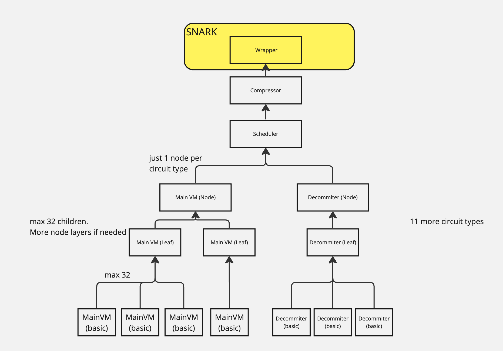

## circuit

作为一个 ZK rollup, 通过zkp的形式将eth上的交易进行压缩，在保留状态更改合法性的同时降低交易费用。

对于 ZKsync，证明者将证明 ZKsync 的 EVM 执行正确，而以太坊上的智能合约将验证该证明是否正确。

具体的步骤：

- Witness generation: witenss的生成可以被认为prover 生成有效证明的关键步骤。当user 发起交易时，会生成相应的witness，新交易将分批证明。这些批次将被处理并发送到电路。
- Circuits: VM 需要证明交易已被正确的执行，这部分则是由电路实现的，为了使证明起作用，必须将正常的代码逻辑转换为证明系统可读的格式。虚拟机读取将要执行的代码，并将各部分分类到各种电路中。然后，这些电路将代码分解成各个部分，然后可以将其发送到证明系统。
- Proof system: zksync 中的证明系统 Boojum.

具体的repo

- **Boojum**: 将其视为工具箱。它包含必要的工具和部件，如证明器（帮助确认电路的功能）、验证器（复查所有内容）和各种其他后端组件。
- **zkevm_circuits**: 构建和存储实际电路的地方。这些电路由 Boojum 构建，旨在复制 EVM 的行为。
- **zkevm_test_harness**: test-demo，在这里，进行不同的测试以确保我们的电路正常工作。此外，它还具有帮助启动和顺利运行这些电路的必要代码

repo  https://github.com/matter-labs/era-zkevm_test_harness.git

在zksync-era的电路设计中有多层电路，era-zkevm-test-harness 这个repo 包含 `outer layer` ，而核心的代码则是在`era-zkevm-circuits`

定义了13种不同的 base layer 电路 (如 MainVM, Decomitter),

3种 递归电路 (Leaf, Node andScheduler).

Base layer circuits are located in `src/base_layer`, Recursive circuits are in `src/recursion_layer`.

同时也有 'AUX' circuits: compressors and wrapper在最终的调度程序证明上运行, and they are
located in `src/aux_layer`.

## Circuit types

12 different circuit types (in witness, you might notice 13, as one circuit (events_dedup_and_sort) is used for
both L1 messages and events).

| Circuit name             | Location                     | Description                                                  |
| ------------------------ | ---------------------------- | ------------------------------------------------------------ |
| Main VM                  | vm_main.rs                   | 执行opcode                                                   |
| CodeDecommittmentsSorter | sort_code_decommit.rs        | 验证代码提交请求的顺序（根据哈希获取字节码）                 |
| CodeDecommiter           | code_decommiter.rs           | 将与给定哈希匹配的字节码解压到内存中                         |
| LogDemuxer               | log_demux.rs                 | 将队列分成 6 个输出队列（如 keccak、sha、storage）           |
| KeccakRoundFunction      | keccak256_round_functions.rs | Round of the keccak hash                                     |
| Sha256RoundFunction      | sha256_round_function.rs     | Round of sha256 hash                                         |
| ECRecover                | ecrecover.rs                 | 验证 ECRecover                                               |
| RAMPermutation           | ram_permutation.rs           | 验证 RAM 访问的正确性 - 查看访问队列，并检查是否读取了正确的字节值 |
| StorageSorter            | storage_sort_dedup.rs        | 类似于 RAM 排列，但用于存储 - 检查是否存储/读取了正确的字节。 |
| StorageApplication       | storage_apply.rs             | 根据计算过程中写入的数据验证最终的 merkle 根和存储差异。     |
| EventsSorter             | events_sort_dedup.rs         | 验证给定的“未排序”队列是否与已排序队列匹配，且无任何重复。在本例中，用于系统事件。 |
| L1MessagesSorter         | events_sort_dedup.rs         | 它重用了上面的电路，但这次是对用户生成的事件（L2 -> L1 消息）进行排序。 |
| L1MessageHasher          | linear_hasher.rs             | 验证 L1 消息的线性哈希是否与队列的内容匹配。                 |

3 recursive circuits:

| Circuit name | Location      | Description                                 |
| ------------ | ------------- | ------------------------------------------- |
| Leaf         | leaf_layer.rs | 聚合32个相同类型的基本电路                  |
| Node         | node_layer.rs | 聚合 32 个相同类型的叶（或节点）电路        |
| Scheduler    | scheduler.rs  | 将 13 个节点（每种类型 1 个）聚合成最终证明 |

And  'wrapper'/AUX circuits on top:

| Circuit name | Location       | Description                                                  |
| ------------ | -------------- | ------------------------------------------------------------ |
| Compression  | compression.rs | 压缩最终的调度程序证明                                       |
| Wrapper      | wrapper.rs     | 将压缩的证明包装成 SNARK 以在 L1 上进行验证。（这是一个 SNARK 电路） |
