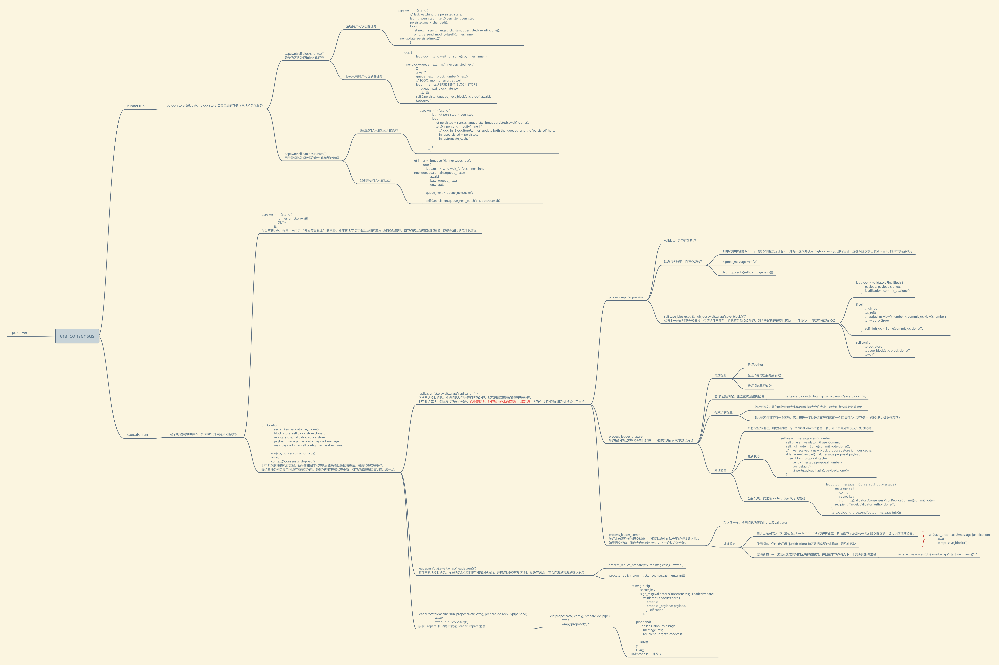

## consensus

Repo: [ear-consensus](https://github.com/matter-labs/era-consensus.git)

使用bft，拜占庭容错的共识算法

入口 node/tools/main.rs

```rust
#[tokio::main]
async fn main()->anyhow::Result<()>{
  ... do something ...
  
  
  scope::run!(ctx, |ctx, s| async {
        let (executor, runner) = configs
            .make_executor(ctx)
            .await
            .context("configs.into_executor()")?;
        s.spawn_bg(runner.run(ctx));
        if let Some(addr) = &configs.app.metrics_server_addr {
            s.spawn_bg(async {
                MetricsExporter::default()
                    .with_graceful_shutdown(ctx.canceled())
                    .start(*addr)
                    .await?;
                Ok(())
            });
        }
        if let Some(rpc_addr) = &configs.app.rpc_addr {
            s.spawn_bg(RPCServer::new(*rpc_addr, executor.block_store.clone()).run(ctx));
        }
        executor.run(ctx).await
    })
    .await
}
```

启动的服务：

* runner.run: bolock store && batch block store 负责区块的存储（本地持久化服务）
* executor.run : 这个则是负责构建proposal，最终区块，共识，验证区块并且持久化的模块。
* RPC server 

几个术语：

* view：在 BFT (拜占庭容错) 共识算法中，**视图 (View)** 是一个重要的概念，它代表着副本节点对系统状态的共识认知。在每个视图中，副本节点会就当前要提交的区块达成一致意见。

* **view的特点:**

  - **视图编号:** 每个视图都有一个唯一的编号，从 1 开始递增。
  - **一致性:** 在同一个视图内，所有副本节点都应该对当前状态 (包括要提交的区块) 拥有相同的认知。
  - **单调递增:** 视图编号是单调递增的，这意味着不可能出现较小的视图编号比较大的视图编号更晚出现的情况。
  - **有限性:** 在有限的时间内，只能存在有限个视图。

  **作用:**

  - **隔离错误:** 视图机制可以帮助隔离拜占庭节点的错误行为。即使存在恶意节点，只要视图编号足够高，其他诚实节点仍然可以达成共识并提交正确的区块。
  - **提高效率:** 视图机制可以提高共识效率。通过限制每个视图中需要达成一致的信息量，可以减少通信开销和共识时间。
  - **简化状态管理:** 视图机制可以简化副本节点的状态管理。每个副本节点只需要维护当前视图的状态信息，而无需存储所有历史视图的信息。

  **变更:**

  - 变更通常发生在以下情况：
    - 领导者节点发生故障或被更换。
    - 收集到足够数量的证据证明存在恶意节点。
    - 共识过程出现超时或无法达成一致。
  - 当视图发生变更时，副本节点会更新自己的视图编号和状态信息，并重新开始共识过程。

  **示例:**

  假设一个 BFT 共识系统中有 5 个副本节点，当前视图编号为 10。领导者节点提出要提交区块 X。

  - 如果所有副本节点都同意提交区块 X，则共识成功，视图保持不变。
  - 如果存在恶意节点拒绝提交区块 X，并且收集到足够数量的证据证明该恶意节点，则视图会变更为 11，并重新选择新的领导者节点。
  - 如果共识过程出现超时，则视图可能会变更为 12，并重新启动共识过程。

QC：在bft中 QC是由一组（通常是多数）验证者的签名组成的，用于证明某个特定状态或消息已经得到足够多的验证者的认可。

**定义**：

- **QC**：Quorum Certificate，指的是一个提案已经获得了足够数量的验证者签名，通常是达到或超过总验证者数量的 2/3。这个签名集合就构成了一个 Quorum Certificate。

**作用**：

- **验证提案**：QC 证明了一个特定提案已经被足够多的验证者批准，这意味着该提案可以被认为是合法的，并且可以在区块链上进一步处理。
- **提高安全性**：通过收集足够多的签名，QC 可以防止拜占庭行为（恶意或故障行为）的验证者对共识过程的影响。即使有少数验证者是恶意的，只要大多数验证者是诚实的，QC 依然可以确保共识的安全性。
- **促进共识**：在 BFT 协议中，每个阶段的提案需要通过 QC 来验证和推进。这确保了共识过程的可靠性和一致性。

