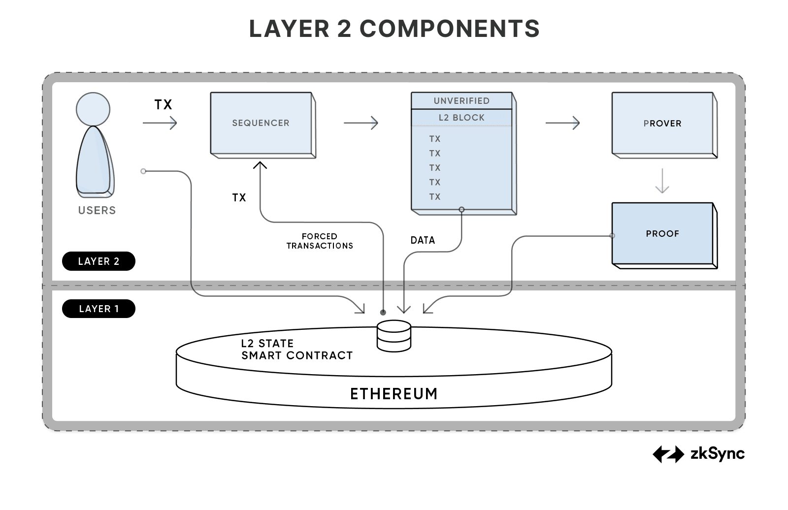
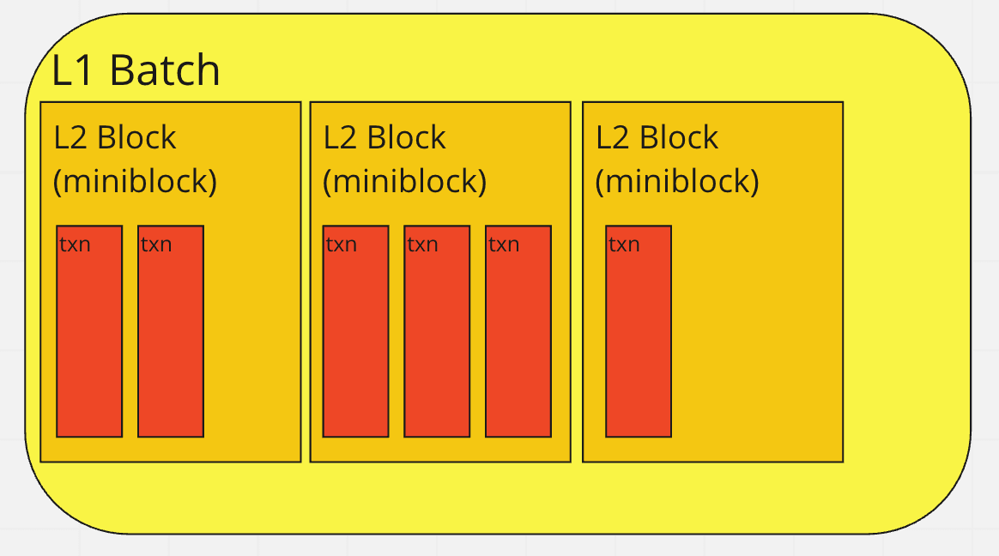

## Zksync-era

### Transaction

#### TX  Lifecycle

用户将交易提交给**排序器**，排序器的作用是使用 **zkEVM 收集和执行这些交易**。排序器还向用户提供有关其交易执行情况的**软确认**。用户可以选择通过 L1 提交交易来强制纳入交易。执行后，排序器将区块转发给证明者，然后**证明者创建区块执行的加密证明。此证明连同必要的数据一起提交给 L1 合约**。L1 智能合约验证证明的有效性和数据提交的完整性，从而更新合约上的汇总状态。

zkEVM 扮演着与以太坊中传统 EVM 相似但又不同的关键角色。交易也可以通过 L1 发起，这有助于 L1<>L2 通信，提供抗审查能力并实现到 L1 的无信任桥梁。

排序器将交易收集到区块中，并通过**较小的区块大小确保快速软确认**，以增强用户体验。与以太坊不同，zkEVM 区分区块和批次，其中批次（区块集合）由证明者处理。

在提交证明之前，数据会被发送到 L1。该方法通过仅详细说明区块链状态的变化（称为“状态差异”）来优化数据提交。这种方法使影响相同存储槽的交易更具成本效益。

#### Tx status

交易始终处于下列状态之一：

- `Pending`：等待纳入区块。
- `Included`：已添加到某个块，但是该块的批次尚未提交。
- `Verified`：在以太坊L1网络上批量提交并执行后纳入并验证。
- `Failed`：交易未验证成功。

### Block && Batch

ZKsync Era 不仅将交易作为单个单元进行处理，还将交易分组为块和批次，以提高效率和成本效益

**L2 区块**（也称为miniblock）是 ZKsync Era 网络特有的，不会记录在以太坊区块链上。这些区块包含的交易数量较少，因此可以快速处理。

每 1 秒生成一个 L2 区块，包含该时间范围内收到的所有交易。这种快速创建可确保交易处理的一致性。

L1 batch 是 ZKsync Era 不可或缺的一部分，因为**它们代表生成证明的计算单位**。从 VM 的角度来看，每个 L1 batch都类似于执行一个程序 - Bootloader，它处理batch的所有交易。

batch的seal取决于几个标准，由**conditional_sealer管理 模块**，包括交易数量、大小限制、gas 限制等。决策过程很复杂，通常需要对超出batch容量的交易采取“尝试并回滚”的方法。

维护`conditional_sealer`的列表`SealCriterion`包括：

* 交易数量限制（即一批交易中可以容纳多少个交易）。
* 交易规模限制（即交易中的总数据/信息）。
* L2 gas限制。
* 已发布的数据限制（因为每个 L1 batch必须将有关更改的插槽的信息发布到 L1，所以所有更改都必须符合 L1 交易限制）。
* L1 Gas 限制（与上面类似，但确保在 L1 上提交、证明和执行交易不会消耗超过可用量的 gas）。
* 电路几何限制 - 对于某些操作（如 Merkle 变换），单个 L1 批次中可以包含的电路数量存在上限。如果超出此限制，将无法生成证明。
* 超时（不太可能使用，但可确保如果根据其他标准没有足够的交易需要密封，则该批次仍然被密封，因此信息将发送到 L1）。

#### ExcludeAndSeal

为了处理事务超出当前活动 L1 批次限制的情况，我们采用了“尝试并回滚”方法。这意味着我们尝试将事务添加到活动 L1 批次，如果收到的响应`ExcludeAndSeal`表明它不适合，则将虚拟机 (VM) 回滚到尝试事务之前的状态。

实施此方法会给虚拟机（也称为接口）带来大量复杂性`oracles`。这些预言机需要支持快照和回滚操作，以确保在处理不适合的事务时保持一致性。

